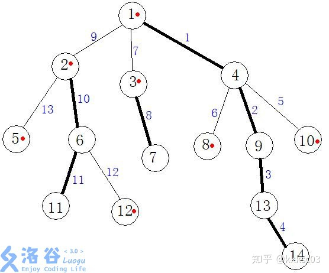

# 树链剖分
[OI-Wiki](https://oi-wiki.org/graph/hld/)

[【洛谷日报#17】树链剖分详解](https://zhuanlan.zhihu.com/p/41082337)

## 基础

定义 **重子节点** 表示其子节点中子树最大的子结点。如果有多个子树最大的子结点，取其一。如果没有子节点，就无重子节点。

定义 **轻子节点** 表示剩余的所有子结点。

从这个结点到重子节点的边为 **重边** 。

到其他轻子节点的边为 **轻边** 。

若干条首尾衔接的重边构成 **重链** 。

把落单的结点也当作重链，那么整棵树就被剖分成若干条重链。

以这棵树为例，敲一下模板：



输入数据：

```
14
1 1 1 2 2 3 4 4 4 6 6 9 13
```

第一遍dfs：

```
dfs(1)
dfs(2)
dfs(5)
dfs(6)
dfs(11)
dfs(12)
dfs(3)
dfs(7)
dfs(4)
dfs(8)
dfs(9)
dfs(13)
dfs(14)
dfs(10)
Node[1]: fa=0, size=14, depth=1, hson=4
Node[2]: fa=1, size=5, depth=2, hson=6
Node[3]: fa=1, size=2, depth=2, hson=7
Node[4]: fa=1, size=6, depth=2, hson=9
Node[5]: fa=2, size=1, depth=3, hson=0
Node[6]: fa=2, size=3, depth=3, hson=11
Node[7]: fa=3, size=1, depth=3, hson=0
Node[8]: fa=4, size=1, depth=3, hson=0
Node[9]: fa=4, size=3, depth=3, hson=13
Node[10]: fa=4, size=1, depth=3, hson=0
Node[11]: fa=6, size=1, depth=4, hson=0
Node[12]: fa=6, size=1, depth=4, hson=0
Node[13]: fa=9, size=2, depth=4, hson=14
Node[14]: fa=13, size=1, depth=5, hson=0
```

第二次dfs后：

```
dfs(1)
dfs(2)
dfs(5)
dfs(6)
dfs(11)
dfs(12)
dfs(3)
dfs(7)
dfs(4)
dfs(8)
dfs(9)
dfs(13)
dfs(14)
dfs(10)
Node[1]: fa=0, size=14, depth=1, hson=4, dfn=1, top=1
Node[2]: fa=1, size=5, depth=2, hson=6, dfn=8, top=2
Node[3]: fa=1, size=2, depth=2, hson=7, dfn=13, top=3
Node[4]: fa=1, size=6, depth=2, hson=9, dfn=2, top=1
Node[5]: fa=2, size=1, depth=3, hson=0, dfn=12, top=5
Node[6]: fa=2, size=3, depth=3, hson=11, dfn=9, top=2
Node[7]: fa=3, size=1, depth=3, hson=0, dfn=14, top=3
Node[8]: fa=4, size=1, depth=3, hson=0, dfn=6, top=8
Node[9]: fa=4, size=3, depth=3, hson=13, dfn=3, top=1
Node[10]: fa=4, size=1, depth=3, hson=0, dfn=7, top=10
Node[11]: fa=6, size=1, depth=4, hson=0, dfn=10, top=2
Node[12]: fa=6, size=1, depth=4, hson=0, dfn=11, top=12
Node[13]: fa=9, size=2, depth=4, hson=14, dfn=4, top=1
Node[14]: fa=13, size=1, depth=5, hson=0, dfn=5, top=1
rank : 0 1 4 9 13 14 8 10 2 6 11 12 5 3 7 
```

代码：

```cpp
#include <bits/stdc++.h>
using namespace std;
int main() {
    freopen("input.txt", "r", stdin);
    int n;
    cin >> n;
    struct Node {
        vector<int> son; // 存放所有子节点
        int fa, size, depth, hson;
        // 父亲节点、子树大小、深度、重子节点
        int dfn, top; // dfs序、链顶
    };
    vector<Node> G(n+1);
    for (int i = 2; i <= n; i++) {
        int x;
        cin >> x;
        G[i].fa = x;
        G[x].son.push_back(i);
    }
    function<void(int)> dfs = [&](int u) {
        cerr << "dfs(" << u << ")\n";
        int hson = 0;
        G[u].size = 1;
        for (auto v : G[u].son) {
            G[v].depth = G[u].depth + 1;
            dfs(v);
            G[u].size += G[v].size;
            if (G[v].size > G[hson].size) hson = v;
        }
        G[u].hson = hson;
    };
    G[1].depth = 1;
    dfs(1);
    auto print = [&](int u) {
        fprintf(stderr, "Node[%d]: fa=%d, size=%d, depth=%d, hson=%d, dfn=%d, top=%d\n", 
            u, G[u].fa, G[u].size, G[u].depth, G[u].hson, G[u].dfn, G[u].top);
    };
    vector<int> rank{0};
    function<void(int, int)> dfs2 = [&](int u, int top) {
        G[u].dfn = (int)rank.size();
        rank.push_back(u);
        G[u].top = top;
        if (G[u].hson == 0) return ;
        dfs2(G[u].hson, top);
        for (auto v : G[u].son) {
            if (v == G[u].hson) continue;
            dfs2(v, v);
        }
    };
    dfs2(1, 1);
    for (int i = 1; i <= n; i++) {
        print(i);
    }
    cerr << "rank : ";
    for (auto i : rank) cerr << i << ' ';
    cerr << '\n';
    return 0;
}
```

## 性质

**树上每个节点都属于且仅属于一条重链** 。

重链开头的结点不一定是重子节点（因为重边是对于每一个结点都有定义的）。

所有的重链将整棵树 **完全剖分** 。

在剖分时 **重边优先遍历** ，最后树的 DFN 序上，重链内的 DFN 序是连续的。按 DFN 排序后的序列即为剖分后的链。

一颗子树内的 DFN 序是连续的。

可以发现，当我们向下经过一条 **轻边** 时，所在子树的大小至少会除以二。

因此，对于树上的任意一条路径，把它拆分成从 lca 分别向两边往下走，分别最多走 lgn 次，因此，树上的每条路径都可以被拆分成不超过 lgn 条重链。


## 应用
### 求LCA

不断向上跳重链，当跳到同一条重链上时，深度较小的结点即为 LCA。

向上跳重链时需要先跳所在重链顶端深度较大的那个。

（代码尚未测试）
TODO: 准备测一下模板题https://www.luogu.com.cn/problem/P3379
```cpp
#include <bits/stdc++.h>
using namespace std;
int main() {
    freopen("input.txt", "r", stdin);
    int n;
    cin >> n;
    struct Node {
        vector<int> son; // 存放所有子节点
        int fa, size, depth, hson;
        // 父亲节点、子树大小、深度、重子节点
        int dfn, top; // dfs序、链顶
    };
    vector<Node> G(n+1);
    for (int i = 2; i <= n; i++) {
        int x;
        cin >> x;
        G[i].fa = x;
        G[x].son.push_back(i);
    }
    function<void(int)> dfs = [&](int u) {
        cerr << "dfs(" << u << ")\n";
        int hson = 0;
        G[u].size = 1;
        for (auto v : G[u].son) {
            G[v].depth = G[u].depth + 1;
            dfs(v);
            G[u].size += G[v].size;
            if (G[v].size > G[hson].size) hson = v;
        }
        G[u].hson = hson;
    };
    G[1].depth = 1;
    dfs(1);
    // auto print = [&](int u) {
    //     fprintf(stderr, "Node[%d]: fa=%d, size=%d, depth=%d, hson=%d, dfn=%d, top=%d\n", 
    //         u, G[u].fa, G[u].size, G[u].depth, G[u].hson, G[u].dfn, G[u].top);
    // };
    vector<int> rank{0};
    function<void(int, int)> dfs2 = [&](int u, int top) {
        G[u].dfn = (int)rank.size();
        rank.push_back(u);
        G[u].top = top;
        if (G[u].hson == 0) return ;
        dfs2(G[u].hson, top);
        for (auto v : G[u].son) {
            if (v == G[u].hson) continue;
            dfs2(v, v);
        }
    };
    dfs2(1, 1);
    // for (int i = 1; i <= n; i++) {
    //     print(i);
    // }
    // cerr << "rank : ";
    // for (auto i : rank) cerr << i << ' ';
    // cerr << '\n';
    auto lca = [&](int x, int y) {
        while (G[x].top != G[y].top) {
            int topx = G[x].top, topy = G[y].top;
            if (G[topx].depth > G[topy].depth) x = G[topx].fa;
            else y = G[topy].fa;
        }
        return G[x].depth < G[y].depth ? x : y;
    };
    
    return 0;
}
```