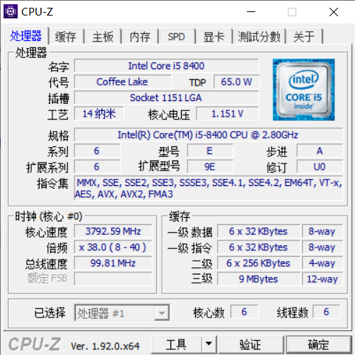
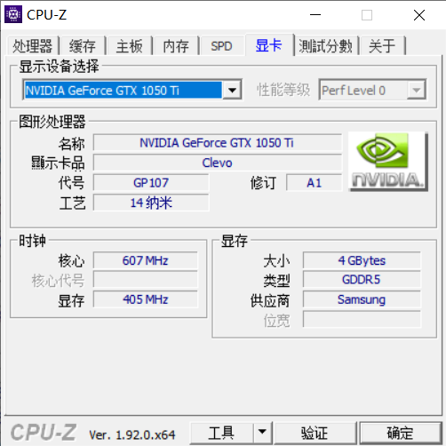

# CUDA初试
## deviceQuery
```
C:\Program Files\NVIDIA GPU Computing Toolkit\CUDA\v11.0\extras\demo_suite>deviceQuery.exe
deviceQuery.exe Starting...

 CUDA Device Query (Runtime API) version (CUDART static linking)

Detected 1 CUDA Capable device(s)

Device 0: "GeForce GTX 1050 Ti"
  CUDA Driver Version / Runtime Version          11.0 / 11.0
  CUDA Capability Major/Minor version number:    6.1
  Total amount of global memory:                 4096 MBytes (4294967296 bytes)
  ( 6) Multiprocessors, (128) CUDA Cores/MP:     768 CUDA Cores
  GPU Max Clock rate:                            1620 MHz (1.62 GHz)
  Memory Clock rate:                             3504 Mhz
  Memory Bus Width:                              128-bit
  L2 Cache Size:                                 1048576 bytes
  Maximum Texture Dimension Size (x,y,z)         1D=(131072), 2D=(131072, 65536), 3D=(16384, 16384, 16384)
  Maximum Layered 1D Texture Size, (num) layers  1D=(32768), 2048 layers
  Maximum Layered 2D Texture Size, (num) layers  2D=(32768, 32768), 2048 layers
  Total amount of constant memory:               zu bytes
  Total amount of shared memory per block:       zu bytes
  Total number of registers available per block: 65536
  Warp size:                                     32
  Maximum number of threads per multiprocessor:  2048
  Maximum number of threads per block:           1024
  Max dimension size of a thread block (x,y,z): (1024, 1024, 64)
  Max dimension size of a grid size    (x,y,z): (2147483647, 65535, 65535)
  Maximum memory pitch:                          zu bytes
  Texture alignment:                             zu bytes
  Concurrent copy and kernel execution:          Yes with 5 copy engine(s)
  Run time limit on kernels:                     Yes
  Integrated GPU sharing Host Memory:            No
  Support host page-locked memory mapping:       Yes
  Alignment requirement for Surfaces:            Yes
  Device has ECC support:                        Disabled
  CUDA Device Driver Mode (TCC or WDDM):         WDDM (Windows Display Driver Model)
  Device supports Unified Addressing (UVA):      Yes
  Device supports Compute Preemption:            Yes
  Supports Cooperative Kernel Launch:            Yes
  Supports MultiDevice Co-op Kernel Launch:      No
  Device PCI Domain ID / Bus ID / location ID:   0 / 1 / 0
  Compute Mode:
     < Default (multiple host threads can use ::cudaSetDevice() with device simultaneously) >

deviceQuery, CUDA Driver = CUDART, CUDA Driver Version = 11.0, CUDA Runtime Version = 11.0, NumDevs = 1, Device0 = GeForce GTX 1050 Ti
Result = PASS
```






CPU计算能力：6核乘以2.8GHz=16.8
GPU计算能力：768 CUDA Cores 乘以1.62GHz=1244.16


## Samples
[v11.0](file:///C:/ProgramData/NVIDIA%20Corporation/CUDA%20Samples/v11.0)

有示例程序再好不过了，不过还是要一些教程配合来看比较好。

[pdf](file:///C:/Program%20Files/NVIDIA%20GPU%20Computing%20Toolkit/CUDA/v11.0/doc/pdf)

一些文档。

那就先不看例程了，先找几个PDF文档看下。

CUDA_Quick_Start_Guide这个名字一看就是为初学者准备的，就是它了。

额，发现它的内容正好是我之前搞完了的，就是下载、安装，用VS打开。

CUDA_Samples

下一个看下这个吧。

看了一下感觉价值不大，改看书了。

为了省事，直接在Samples里面建立我的项目了。

## template
直接先分析一下Simple里的template吧。
### readme.txt
先是README。

```
Sample: template
Minimum spec: SM 3.5

A trivial template project that can be used as a starting point to create new CUDA projects.

Key concepts:
Device Memory Allocation

```

参考：[Nvidia GPU架构 - Cuda Core，SM，SP等等傻傻分不清？](https://blog.csdn.net/asasasaababab/article/details/80447254)

接下来是VS的工程文件

### template_vs2019.sln

解决方案文件：

```sln
Microsoft Visual Studio Solution File, Format Version 12.00
# Visual Studio Version 16
VisualStudioVersion = 16.0.30413.136
MinimumVisualStudioVersion = 10.0.40219.1
Project("{8BC9CEB8-8B4A-11D0-8D11-00A0C91BC942}") = "template", "template_vs2019.vcxproj", "{1FCEA725-FCE3-42FF-A447-540A7219190D}"
EndProject
Global
	GlobalSection(SolutionConfigurationPlatforms) = preSolution
		Debug|x64 = Debug|x64
		Release|x64 = Release|x64
	EndGlobalSection
	GlobalSection(ProjectConfigurationPlatforms) = postSolution
		{1FCEA725-FCE3-42FF-A447-540A7219190D}.Debug|x64.ActiveCfg = Debug|x64
		{1FCEA725-FCE3-42FF-A447-540A7219190D}.Debug|x64.Build.0 = Debug|x64
		{1FCEA725-FCE3-42FF-A447-540A7219190D}.Release|x64.ActiveCfg = Release|x64
		{1FCEA725-FCE3-42FF-A447-540A7219190D}.Release|x64.Build.0 = Release|x64
	EndGlobalSection
	GlobalSection(SolutionProperties) = preSolution
		HideSolutionNode = FALSE
	EndGlobalSection
	GlobalSection(ExtensibilityGlobals) = postSolution
		SolutionGuid = {89064252-E2AD-420F-A2C7-22B3CC01D861}
	EndGlobalSection
EndGlobal

```

### template_vs2019.vcxproj

VC工程文件：

```vcproj
<?xml version="1.0" encoding="utf-8"?>
<Project DefaultTargets="Build" ToolsVersion="4.0" xmlns="http://schemas.microsoft.com/developer/msbuild/2003">
  <PropertyGroup>
    <CUDAPropsPath Condition="'$(CUDAPropsPath)'==''">$(VCTargetsPath)\BuildCustomizations</CUDAPropsPath>
  </PropertyGroup>
  <ItemGroup Label="ProjectConfigurations">
    <ProjectConfiguration Include="Debug|x64">
      <Configuration>Debug</Configuration>
      <Platform>x64</Platform>
    </ProjectConfiguration>
    <ProjectConfiguration Include="Release|x64">
      <Configuration>Release</Configuration>
      <Platform>x64</Platform>
    </ProjectConfiguration>
  </ItemGroup>
  <PropertyGroup Label="Globals">
    <ProjectGuid>{1FCEA725-FCE3-42FF-A447-540A7219190D}</ProjectGuid>
    <RootNamespace>template_vs2019</RootNamespace>
    <ProjectName>template</ProjectName>
    <CudaToolkitCustomDir />
  </PropertyGroup>
  <Import Project="$(VCTargetsPath)\Microsoft.Cpp.Default.props" />
  <PropertyGroup>
    <ConfigurationType>Application</ConfigurationType>
    <CharacterSet>MultiByte</CharacterSet>
    <PlatformToolset>v142</PlatformToolset>
    <WindowsTargetPlatformVersion>10.0</WindowsTargetPlatformVersion>
  </PropertyGroup>
  <PropertyGroup Condition="'$(Configuration)'=='Debug'">
    <UseDebugLibraries>true</UseDebugLibraries>
  </PropertyGroup>
  <PropertyGroup Condition="'$(Configuration)'=='Release'">
    <WholeProgramOptimization>true</WholeProgramOptimization>
  </PropertyGroup>
  <Import Project="$(VCTargetsPath)\Microsoft.Cpp.props" />
  <ImportGroup Label="ExtensionSettings">
    <Import Project="$(CUDAPropsPath)\CUDA 11.0.props" />
  </ImportGroup>
  <ImportGroup Label="PropertySheets">
    <Import Condition="exists('$(UserRootDir)\Microsoft.Cpp.$(Platform).user.props')" Label="LocalAppDataPlatform" Project="$(UserRootDir)\Microsoft.Cpp.$(Platform).user.props" />
  </ImportGroup>
  <PropertyGroup Label="UserMacros" />
  <PropertyGroup>
    <IntDir>$(Platform)/$(Configuration)/</IntDir>
    <IncludePath>$(IncludePath)</IncludePath>
    <CodeAnalysisRuleSet>AllRules.ruleset</CodeAnalysisRuleSet>
    <CodeAnalysisRules />
    <CodeAnalysisRuleAssemblies />
  </PropertyGroup>
  <PropertyGroup Condition="'$(Platform)'=='x64'">
    <OutDir>../../bin/win64/$(Configuration)/</OutDir>
  </PropertyGroup>
  <ItemDefinitionGroup>
    <ClCompile>
      <WarningLevel>Level3</WarningLevel>
      <PreprocessorDefinitions>WIN32;_MBCS;%(PreprocessorDefinitions)</PreprocessorDefinitions>
      <AdditionalIncludeDirectories>./;$(CudaToolkitDir)/include;../../common/inc;</AdditionalIncludeDirectories>
    </ClCompile>
    <Link>
      <SubSystem>Console</SubSystem>
      <AdditionalDependencies>cudart_static.lib;kernel32.lib;user32.lib;gdi32.lib;winspool.lib;comdlg32.lib;advapi32.lib;shell32.lib;ole32.lib;oleaut32.lib;uuid.lib;odbc32.lib;odbccp32.lib;%(AdditionalDependencies)</AdditionalDependencies>
      <AdditionalLibraryDirectories>$(CudaToolkitLibDir);</AdditionalLibraryDirectories>
      <OutputFile>$(OutDir)/template.exe</OutputFile>
    </Link>
    <CudaCompile>
      <CodeGeneration>compute_35,sm_35;compute_37,sm_37;compute_50,sm_50;compute_52,sm_52;compute_60,sm_60;compute_61,sm_61;compute_70,sm_70;compute_75,sm_75;compute_80,sm_80;</CodeGeneration>
      <AdditionalOptions>-Xcompiler "/wd 4819" %(AdditionalOptions)</AdditionalOptions>
      <Include>./;../../common/inc</Include>
      <Defines>WIN32</Defines>
    </CudaCompile>
  </ItemDefinitionGroup>
  <ItemDefinitionGroup Condition="'$(Configuration)'=='Debug'">
    <ClCompile>
      <Optimization>Disabled</Optimization>
      <RuntimeLibrary>MultiThreadedDebug</RuntimeLibrary>
    </ClCompile>
    <Link>
      <GenerateDebugInformation>true</GenerateDebugInformation>
      <LinkTimeCodeGeneration>Default</LinkTimeCodeGeneration>
    </Link>
    <CudaCompile>
      <Runtime>MTd</Runtime>
      <TargetMachinePlatform>64</TargetMachinePlatform>
    </CudaCompile>
  </ItemDefinitionGroup>
  <ItemDefinitionGroup Condition="'$(Configuration)'=='Release'">
    <ClCompile>
      <Optimization>MaxSpeed</Optimization>
      <RuntimeLibrary>MultiThreaded</RuntimeLibrary>
    </ClCompile>
    <Link>
      <GenerateDebugInformation>false</GenerateDebugInformation>
      <LinkTimeCodeGeneration>UseLinkTimeCodeGeneration</LinkTimeCodeGeneration>
    </Link>
    <CudaCompile>
      <Runtime>MT</Runtime>
      <TargetMachinePlatform>64</TargetMachinePlatform>
    </CudaCompile>
  </ItemDefinitionGroup>
  <ItemGroup>
    <CudaCompile Include="template.cu" />
    <ClCompile Include="template_cpu.cpp" />
  </ItemGroup>
  <Import Project="$(VCTargetsPath)\Microsoft.Cpp.targets" />
  <ImportGroup Label="ExtensionTargets">
    <Import Project="$(CUDAPropsPath)\CUDA 11.0.targets" />
  </ImportGroup>
</Project>
```

几个重要的信息点：

可执行文件输出目录：[../../bin/win64/$(Configuration)/](file:///C:/ProgramData/NVIDIA%20Corporation/CUDA%20Samples/v11.0/bin/win64/Debug)

头文件包含目录：`./;$(CudaToolkitDir)/include;../../common/inc;`

链接的库文件：cudart_static.lib;kernel32.lib;user32.lib;gdi32.lib;winspool.lib;comdlg32.lib;advapi32.lib;shell32.lib;ole32.lib;oleaut32.lib;uuid.lib;odbc32.lib;odbccp32.lib;

### template_cpu.cpp

终于到C++代码文件了。

省略了部分说明。

```cpp
// export C interface
extern "C"
void computeGold(float *reference, float *idata, const unsigned int len);


////////////////////////////////////////////////////////////////////////////////
//! Compute reference data set
//! Each element is multiplied with the number of threads / array length
//! @param reference  reference data, computed but preallocated
//! @param idata      input data as provided to device
//! @param len        number of elements in reference / idata
////////////////////////////////////////////////////////////////////////////////
void
computeGold(float *reference, float *idata, const unsigned int len)
{
    const float f_len = static_cast<float>(len);

    for (unsigned int i = 0; i < len; ++i)
    {
        reference[i] = idata[i] * f_len;
    }
}

```

作用很简单，长度为len的idata中的数据都乘以len，存放到reference，要确保reference实现分配好内存。

### template.cu
到了最关键的cuda文件啦。

先是头文件包含

```cpp
// includes, system
#include <stdlib.h>
#include <stdio.h>
#include <string.h>
#include <math.h>

// includes CUDA
#include <cuda_runtime.h>

// includes, project
#include <helper_cuda.h>
#include <helper_functions.h> // helper functions for SDK examples
```

从上面的vcproj文件可以容易推测出这几个头文件的位置。

然后是前置声明。

```cpp
// declaration, forward
void runTest(int argc, char **argv);

extern "C"
void computeGold(float *reference, float *idata, const unsigned int len);

```

最关键的部分来了，一个核函数（运行在GPU上的函数）的实现。

```cpp
////////////////////////////////////////////////////////////////////////////////
//! Simple test kernel for device functionality
//! @param g_idata  input data in global memory
//! @param g_odata  output data in global memory
////////////////////////////////////////////////////////////////////////////////
__global__ void
testKernel(float *g_idata, float *g_odata)
```

（今天有点晚了，明天再搞）
参考：[cuda 函数前缀：__device__、__global__、__host__ 相关问题](https://blog.csdn.net/Aidam_Bo/article/details/88430765)
CUDA C语言对C语言的扩展之一就是加入了一些函数前缀，在CUDA中有三种函数前缀：device，global，host。

三种前缀分别用于在定义函数时限定该函数的调用和执行方式，例如：
（1）__host__ int foo(int a){}与C或者C++中的foo(int a){}相同，是由CPU调用，由CPU执行的函数 
（2）__global__ int foo(int a){}表示一个内核函数，是一组由GPU执行的并行计算任务，以foo<<>>(a)的形式或者driver API的形式调用。目前__global__函数必须由CPU调用，并将并行计算任务发射到GPU的任务调用单元。随着GPU可编程能力的进一步提高，未来可能可以由GPU调用。
（3）__device__ int foo(int a){}则表示一个由GPU中一个线程调用的函数。由于Tesla架构的GPU允许线程调用函数，因此实际上是将__device__ 函数以__inline形式展开后直接编译到二进制代码中实现的，并不是真正的函数。

具体来说，device前缀定义的函数只能在GPU上执行，所以device修饰的函数里面不能调用一般常见的函数；global前缀，CUDA允许能够在CPU，GPU两个设备上运行，但是也不能运行CPU里常见的函数；host前缀修饰的事普通函数，默认缺省，可以调用普通函数。

```cpp
{
    // shared memory
    // the size is determined by the host application
    extern  __shared__  float sdata[];

    // access thread id
    const unsigned int tid = threadIdx.x;
    // access number of threads in this block
    const unsigned int num_threads = blockDim.x;

    // read in input data from global memory
    sdata[tid] = g_idata[tid];
    __syncthreads();

    // perform some computations
    sdata[tid] = (float) num_threads * sdata[tid];
    __syncthreads();

    // write data to global memory
    g_odata[tid] = sdata[tid];
}
```

参考：[CUDA共享内存操作(__shared__关键字)](https://blog.csdn.net/BOBOyspa/article/details/88642858)
