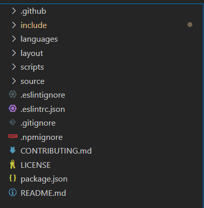

# icarus源代码分析
就以我的博客内的主题为例进行分析。

目录结构如图



[hexo主题结构](https://hexo.io/zh-cn/docs/themes)

首先启动时会自动运行`scripts`文件夹下的内容。

## scripts/index.js

```js

/* global hexo */
const logger = require('hexo-log')();

/**
 * Print welcome message
 */
logger.info(`=========== TOOTAL BLOG ===========`);

/**
 * Check if all dependencies are installed
 */
require('../include/dependency')(hexo);

/**
 * Configuration file checking and migration
 */
require('../include/config')(hexo);

/**
 * Register Hexo extensions and remove Hexo filters that could cause OOM
 */
require('../include/register')(hexo);

```

内容很少，首先是引入了`hexo-log`这个库。

