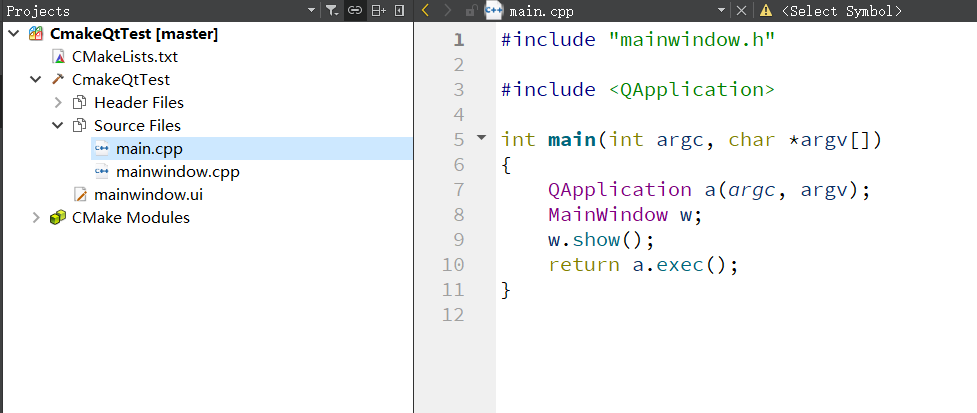

# 使用CMake编译Qt工程
之前用Qt一直都是用Qt自带的QMake，感觉挺好用的，文档也很详细，不过即将到来的Qt6据说要默认使用CMake作为项目管理工具。所以准备提前了解 一下。

首先创建了一个Qt Widget项目，使用CMake构建工具，为了测试，同时创建了翻译文件和UI文件等，还加入了Git版本控制。



代码上面倒是和QMake的没有变化，编译一下也能正常运行。

接下来就是关键的地方了，`CMakeList.txt`。

## CMakeList.txt

如同QMake使用`.pro`文件、make使用`makefile`文件一样，CMake使用`CMakeList.txt`。不过不一样的是，CMake和QMake都是make的进一步抽象，所以他们都是先生成`Makefile`，再调用make进行编译。

```cmake
cmake_minimum_required(VERSION 3.5)

project(CmakeQtTest LANGUAGES CXX)

set(CMAKE_INCLUDE_CURRENT_DIR ON)

set(CMAKE_AUTOUIC ON)
set(CMAKE_AUTOMOC ON)
set(CMAKE_AUTORCC ON)

set(CMAKE_CXX_STANDARD 11)
set(CMAKE_CXX_STANDARD_REQUIRED ON)

# QtCreator supports the following variables for Android, which are identical to qmake Android variables.
# Check http://doc.qt.io/qt-5/deployment-android.html for more information.
# They need to be set before the find_package(Qt5 ...) call.

#if(ANDROID)
#    set(ANDROID_PACKAGE_SOURCE_DIR "${CMAKE_CURRENT_SOURCE_DIR}/android")
#    if (ANDROID_ABI STREQUAL "armeabi-v7a")
#        set(ANDROID_EXTRA_LIBS
#            ${CMAKE_CURRENT_SOURCE_DIR}/path/to/libcrypto.so
#            ${CMAKE_CURRENT_SOURCE_DIR}/path/to/libssl.so)
#    endif()
#endif()

find_package(Qt5 COMPONENTS Widgets LinguistTools REQUIRED)

set(TS_FILES CmakeQtTest_zh_CN.ts)

if(ANDROID)
  add_library(CmakeQtTest SHARED
    main.cpp
    mainwindow.cpp
    mainwindow.h
    mainwindow.ui
    ${TS_FILES}
  )
else()
  add_executable(CmakeQtTest
    main.cpp
    mainwindow.cpp
    mainwindow.h
    mainwindow.ui
    ${TS_FILES}
  )
endif()

target_link_libraries(CmakeQtTest PRIVATE Qt5::Widgets)

qt5_create_translation(QM_FILES ${CMAKE_SOURCE_DIR} ${TS_FILES})

```

QT的文档是非常方便的，如果有不了解的类，可以直接在IDE中查看帮助文档，写的十分详细。之前我也在担心，切换到CMake会不会不自带文档了，这会带来很糟糕的体验。


