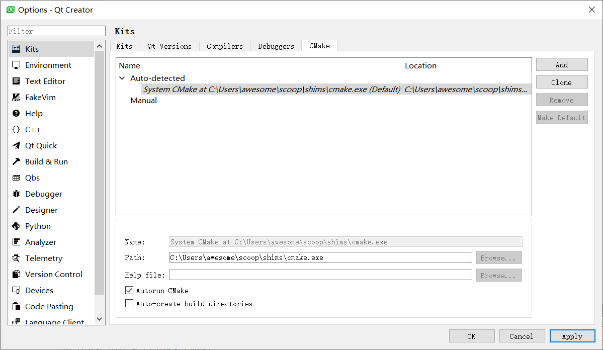
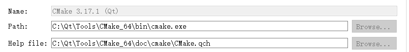
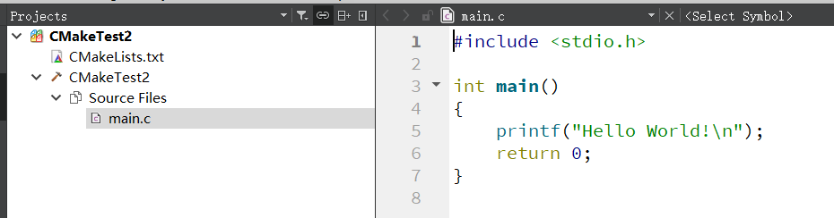
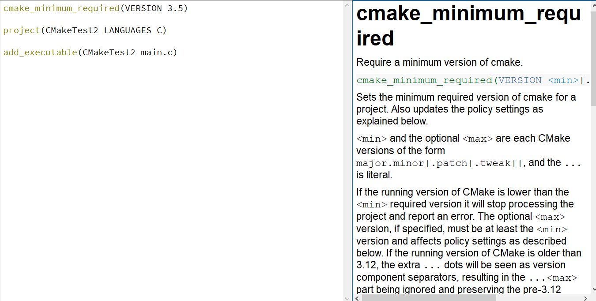
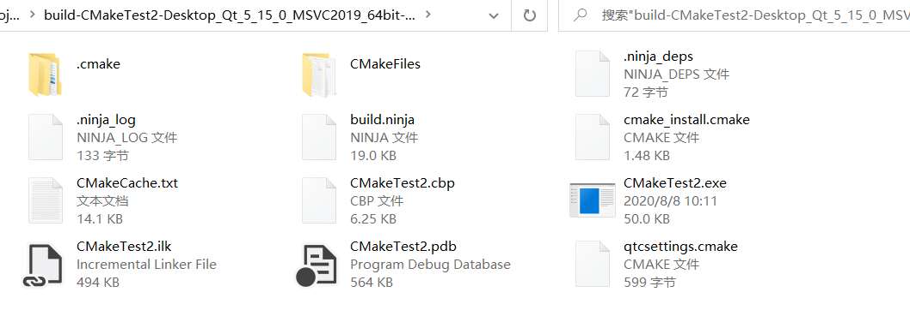
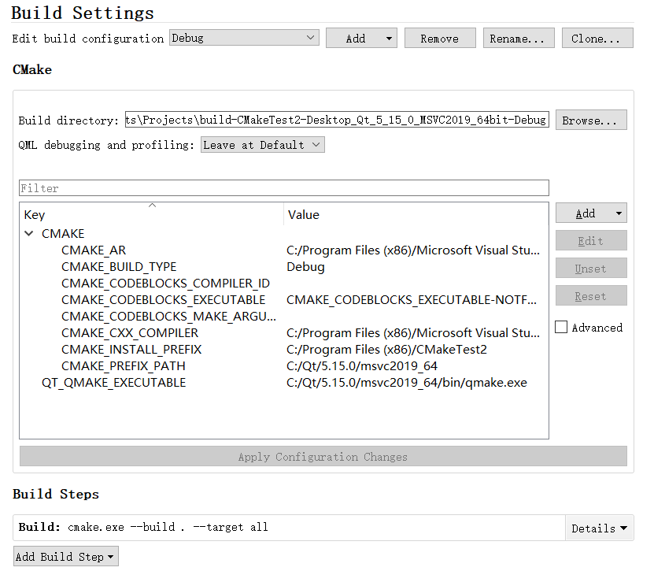
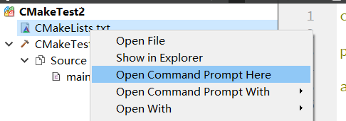
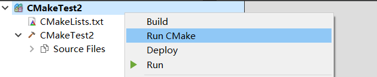

# 使用CMake编译Qt工程2
20200808
## Qt Creator 支持CMake文档

发现QtCreator不能识别自己安装的CMake的帮助文件，于是我决定先安装一下Qt附带的CMake。

果然可以，再换成自己的。



按照上面的路径来设置就可以了。

OK，完成。

接下来就是参考几个例子了。

## 单文件C
工程名：CMakeTest2
单个文件：main.c



```CMakeLists
cmake_minimum_required(VERSION 3.5)

project(CMakeTest2 LANGUAGES C)

add_executable(CMakeTest2 main.c)

```



有内置文档还是非常爽的。

> Selects which programming languages are needed to build the project. Supported languages include C, CXX (i.e. C++), CUDA, OBJC (i.e. Objective-C), OBJCXX, Fortran, and ASM. By default C and CXX are enabled if no language options are given. Specify language NONE, or use the LANGUAGES keyword and list no languages, to skip enabling any languages. 

接下来观察一下编译运行的情况。


目前的代码文件。

成功运行，但是编译的文件放在了外层文件夹中。



## 命令行编译

接下来我打算跳过QtCreator，直接在命令行编译一下。

首先看看执行了哪些步骤。



我们也创建一个文件夹存放编译产物。

为了方便期间，就直接在内部创建了。



```cmd
C:\Users\awesome\Documents\Projects\CMakeTest2>dir
 驱动器 C 中的卷没有标签。
 卷的序列号是 0A71-31FC

 C:\Users\awesome\Documents\Projects\CMakeTest2 的目录

2020/08/08  10:16    <DIR>          .
2020/08/08  10:16    <DIR>          ..
2020/08/08  10:01               109 CMakeLists.txt
2020/08/08  10:16            25,192 CMakeLists.txt.user
2020/08/08  10:01                86 main.c
               3 个文件         25,387 字节
               2 个目录 62,267,224,064 可用字节

C:\Users\awesome\Documents\Projects\CMakeTest2>mkdir build

C:\Users\awesome\Documents\Projects\CMakeTest2>cd build

C:\Users\awesome\Documents\Projects\CMakeTest2\build>cmake ..
-- Building for: Visual Studio 16 2019
-- Selecting Windows SDK version 10.0.18362.0 to target Windows 10.0.19041.
-- The C compiler identification is MSVC 19.26.28806.0
-- Detecting C compiler ABI info
-- Detecting C compiler ABI info - done
-- Check for working C compiler: C:/Program Files (x86)/Microsoft Visual Studio/2019/Community/VC/Tools/MSVC/14.26.28801
/bin/Hostx64/x64/cl.exe - skipped
-- Detecting C compile features
-- Detecting C compile features - done
-- Configuring done
-- Generating done
-- Build files have been written to: C:/Users/awesome/Documents/Projects/CMakeTest2/build
```

::: alert-info
注意：CMake指令后的路径是源码所在路径（含有CMakeLists.txt文件），CMake命令执行时所在的当前目录是编译后的产物存放的目录。
:::


## Qt Creator运行过程探究
我在用命令行编译的过程中遇到了一些问题。
准备先探究一下Qt Creator是怎么编译的。



执行Run CMake。

```log
Running C:\Users\awesome\scoop\shims\cmake.exe "-GCodeBlocks - Ninja" C:/Users/awesome/Documents/Projects/CMakeTest2 in C:\Users\awesome\AppData\Local\Temp\QtCreator-dNsidB\qtc-cmake-RfFjYXlQ.
-- Configuring done
-- Generating done
-- Build files have been written to: C:/Users/awesome/AppData/Local/Temp/QtCreator-dNsidB/qtc-cmake-RfFjYXlQ
Elapsed time: 00:00.
```

先看看上面的命令是什么意思。

[深入理解CMake(2):初步解读Caffe的CMake脚本](https://www.jianshu.com/p/089b458ab8d5)

这个系列不错。

上面命令的意思是在`C:\Users\awesome\AppData\Local\Temp\QtCreator-dNsidB\qtc-cmake-RfFjYXlQ`目录下执行CMake命令，指定生成器为`CodeBlocks - Ninja`，指定源代码目录为`C:/Users/awesome/Documents/Projects/CMakeTest2`。

执行Build命令。

```log
Running C:\Users\awesome\scoop\shims\cmake.exe "-GCodeBlocks - Ninja" -C C:\Users\awesome\Documents\Projects\build-CMakeTest2-Desktop_Qt_5_15_0_MSVC2019_64bit-Debug\qtcsettings.cmake C:/Users/awesome/Documents/Projects/CMakeTest2 in C:\Users\awesome\Documents\Projects\build-CMakeTest2-Desktop_Qt_5_15_0_MSVC2019_64bit-Debug.
loading initial cache file C:\Users\awesome\Documents\Projects\build-CMakeTest2-Desktop_Qt_5_15_0_MSVC2019_64bit-Debug\qtcsettings.cmake
-- The C compiler identification is MSVC 19.26.28806.0
-- Detecting C compiler ABI info
-- Detecting C compiler ABI info - done
-- Check for working C compiler: C:/Program Files (x86)/Microsoft Visual Studio/2019/Community/VC/Tools/MSVC/14.26.28801/bin/HostX64/x64/cl.exe - skipped
-- Detecting C compile features
-- Detecting C compile features - done
-- Configuring done
-- Generating done
-- Build files have been written to: C:/Users/awesome/Documents/Projects/build-CMakeTest2-Desktop_Qt_5_15_0_MSVC2019_64bit-Debug
Elapsed time: 00:01.
```

这里又多了一个`-C`选项。

> `-C <initial-cache>           = Pre-load a script to populate the cache.`

就是预先加载了一个脚本，里面设置了一些变量。

```cmake
# This file is managed by Qt Creator, do not edit!

set("CMAKE_BUILD_TYPE" "Debug" CACHE "STRING" "" FORCE)
set("CMAKE_CXX_COMPILER" "C:/Program Files (x86)/Microsoft Visual Studio/2019/Community/VC/Tools/MSVC/14.26.28801/bin/HostX64/x64/cl.exe" CACHE "STRING" "" FORCE)
set("CMAKE_C_COMPILER" "C:/Program Files (x86)/Microsoft Visual Studio/2019/Community/VC/Tools/MSVC/14.26.28801/bin/HostX64/x64/cl.exe" CACHE "STRING" "" FORCE)
set("CMAKE_PREFIX_PATH" "C:/Qt/5.15.0/msvc2019_64" CACHE "STRING" "" FORCE)
set("QT_QMAKE_EXECUTABLE" "C:/Qt/5.15.0/msvc2019_64/bin/qmake.exe" CACHE "STRING" "" FORCE)
```

我放弃了，QtCreator怎么编译的我也搞不懂，能用就行了。

## 命令行构建
接着上面的命令行编译，这次目标是生成可执行文件。

CMake的生成目标应该是下面这个：

> NMake Makefiles              = Generates NMake makefiles.

尝试构建：

```cmd
C:\Users\awesome\Documents\Projects\CMakeTest2>mkdir build

C:\Users\awesome\Documents\Projects\CMakeTest2>cd build

C:\Users\awesome\Documents\Projects\CMakeTest2\build>cmake "-GNMake Makefiles" ..
-- The C compiler identification is unknown
CMake Error at CMakeLists.txt:3 (project):
  The CMAKE_C_COMPILER:

    cl

  is not a full path and was not found in the PATH.

  To use the NMake generator with Visual C++, cmake must be run from a shell
  that can use the compiler cl from the command line.  This environment is
  unable to invoke the cl compiler.  To fix this problem, run cmake from the
  Visual Studio Command Prompt (vcvarsall.bat).

  Tell CMake where to find the compiler by setting either the environment
  variable "CC" or the CMake cache entry CMAKE_C_COMPILER to the full path to
  the compiler, or to the compiler name if it is in the PATH.


-- Configuring incomplete, errors occurred!
See also "C:/Users/awesome/Documents/Projects/CMakeTest2/build/CMakeFiles/CMakeOutput.log".
See also "C:/Users/awesome/Documents/Projects/CMakeTest2/build/CMakeFiles/CMakeError.log".

```

出现错误，提示找不到cl？

上面提示的很清楚了，要在VC环境下运行cmake，我之前写过一个脚本，可以很方便的初始化vc环境。

内容如下：

```cmd
@echo off
set VS_VERSION=2019
set VCINSTALLDIR=C:\Program Files (x86)\Microsoft Visual Studio\%VS_VERSION%\Community\VC
call "%VCINSTALLDIR%\Auxiliary\Build\vcvarsall.bat" x64
```

把这个文件命名为`vscmd.bat`放在PATH变量下的目录即可。

再次尝试构建。

```cmd
C:\Users\awesome\Documents\Projects\CMakeTest2\build>vscmd
**********************************************************************
** Visual Studio 2019 Developer Command Prompt v16.6.1
** Copyright (c) 2020 Microsoft Corporation
**********************************************************************
[vcvarsall.bat] Environment initialized for: 'x64'

C:\Users\awesome\Documents\Projects\CMakeTest2\build>cmake "-GNMake Makefiles" ..
-- The C compiler identification is MSVC 19.26.28806.0
-- Detecting C compiler ABI info
-- Detecting C compiler ABI info - failed
-- Check for working C compiler: C:/Program Files (x86)/Microsoft Visual Studio/2019/Community/VC/Tools/MSVC/14.26.28801
/bin/Hostx64/x64/cl.exe
-- Check for working C compiler: C:/Program Files (x86)/Microsoft Visual Studio/2019/Community/VC/Tools/MSVC/14.26.28801
/bin/Hostx64/x64/cl.exe - broken
CMake Error at C:/Users/awesome/scoop/apps/cmake/3.18.1/share/cmake-3.18/Modules/CMakeTestCCompiler.cmake:66 (message):
  The C compiler

    "C:/Program Files (x86)/Microsoft Visual Studio/2019/Community/VC/Tools/MSVC/14.26.28801/bin/Hostx64/x64/cl.exe"

  is not able to compile a simple test program.

  It fails with the following output:

    Change Dir: C:/Users/awesome/Documents/Projects/CMakeTest2/build/CMakeFiles/CMakeTmp

    Run Build Command(s):nmake /nologo cmTC_91adc\fast &&       "C:\Program Files (x86)\Microsoft Visual Studio\2019\Com
munity\VC\Tools\MSVC\14.26.28801\bin\HostX64\x64\nmake.exe"  -f CMakeFiles\cmTC_91adc.dir\build.make /nologo -L
         CMakeFiles\cmTC_91adc.dir\build
    Building C object CMakeFiles/cmTC_91adc.dir/testCCompiler.c.obj
        C:\PROGRA~2\MICROS~2\2019\COMMUN~1\VC\Tools\MSVC\1426~1.288\bin\Hostx64\x64\cl.exe @C:\Users\awesome\AppData\Loc
al\Temp\nm41DD.tmp
    testCCompiler.c
    Linking C executable cmTC_91adc.exe
        C:\Users\awesome\scoop\apps\cmake\3.18.1\bin\cmake.exe -E vs_link_exe --intdir=CMakeFiles\cmTC_91adc.dir --rc=C:
\PROGRA~2\WI3CF2~1\10\bin\100183~1.0\x64\rc.exe --mt=C:\PROGRA~2\WI3CF2~1\10\bin\100183~1.0\x64\mt.exe --manifests -- C:
\Programs\mingw\m64-101\bin\ld.exe /nologo @CMakeFiles\cmTC_91adc.dir\objects1.rsp @C:\Users\awesome\AppData\Local\Temp\
nm421C.tmp
    LINK Pass 1: command "C:\Programs\mingw\m64-101\bin\ld.exe /nologo @CMakeFiles\cmTC_91adc.dir\objects1.rsp /out:cmTC
_91adc.exe /implib:cmTC_91adc.lib /pdb:C:\Users\awesome\Documents\Projects\CMakeTest2\build\CMakeFiles\CMakeTmp\cmTC_91a
dc.pdb /version:0.0 /debug /INCREMENTAL /subsystem:console kernel32.lib user32.lib gdi32.lib winspool.lib shell32.lib ol
e32.lib oleaut32.lib uuid.lib comdlg32.lib advapi32.lib /MANIFEST /MANIFESTFILE:CMakeFiles\cmTC_91adc.dir/intermediate.m
anifest CMakeFiles\cmTC_91adc.dir/manifest.res" failed (exit code 1) with the following output:
    C:\Programs\mingw\m64-101\bin\ld.exe: cannot find /nologo: No such file or directory
    C:\Programs\mingw\m64-101\bin\ld.exe: cannot find /out:cmTC_91adc.exe: No such file or directory
    C:\Programs\mingw\m64-101\bin\ld.exe: cannot find /implib:cmTC_91adc.lib: No such file or directory
    C:\Programs\mingw\m64-101\bin\ld.exe: cannot find /pdb:C:\Users\awesome\Documents\Projects\CMakeTest2\build\CMakeFil
es\CMakeTmp\cmTC_91adc.pdb: Invalid argument
    C:\Programs\mingw\m64-101\bin\ld.exe: cannot find /version:0.0: No such file or directory
    C:\Programs\mingw\m64-101\bin\ld.exe: cannot find /debug: No such file or directory
    C:\Programs\mingw\m64-101\bin\ld.exe: cannot find /INCREMENTAL: No such file or directory
    C:\Programs\mingw\m64-101\bin\ld.exe: cannot find /subsystem:console: No such file or directory
    C:\Programs\mingw\m64-101\bin\ld.exe: cannot find kernel32.lib: No such file or directory
    C:\Programs\mingw\m64-101\bin\ld.exe: cannot find user32.lib: No such file or directory
    C:\Programs\mingw\m64-101\bin\ld.exe: cannot find gdi32.lib: No such file or directory
    C:\Programs\mingw\m64-101\bin\ld.exe: cannot find winspool.lib: No such file or directory
    C:\Programs\mingw\m64-101\bin\ld.exe: cannot find shell32.lib: No such file or directory
    C:\Programs\mingw\m64-101\bin\ld.exe: cannot find ole32.lib: No such file or directory
    C:\Programs\mingw\m64-101\bin\ld.exe: cannot find oleaut32.lib: No such file or directory
    C:\Programs\mingw\m64-101\bin\ld.exe: cannot find uuid.lib: No such file or directory
    C:\Programs\mingw\m64-101\bin\ld.exe: cannot find comdlg32.lib: No such file or directory
    C:\Programs\mingw\m64-101\bin\ld.exe: cannot find advapi32.lib: No such file or directory
    C:\Programs\mingw\m64-101\bin\ld.exe: cannot find /MANIFEST: No such file or directory
    C:\Programs\mingw\m64-101\bin\ld.exe: cannot find /MANIFESTFILE:CMakeFiles\cmTC_91adc.dir/intermediate.manifest: Inv
alid argument
    CMakeFiles\cmTC_91adc.dir/manifest.res: file not recognized: file format not recognized
    NMAKE : fatal error U1077: “C:\Users\awesome\scoop\apps\cmake\3.18.1\bin\cmake.exe”: 返回代码“0xffffffff”
    Stop.
    NMAKE : fatal error U1077: “"C:\Program Files (x86)\Microsoft Visual Studio\2019\Community\VC\Tools\MSVC\14.26.28801
\bin\HostX64\x64\nmake.exe"”: 返回代码“0x2”
    Stop.


  CMake will not be able to correctly generate this project.
Call Stack (most recent call first):
  CMakeLists.txt:3 (project)


-- Configuring incomplete, errors occurred!
See also "C:/Users/awesome/Documents/Projects/CMakeTest2/build/CMakeFiles/CMakeOutput.log".
See also "C:/Users/awesome/Documents/Projects/CMakeTest2/build/CMakeFiles/CMakeError.log".

```

有失败了。。。

## 尝试CMake gui


只能试试这个了。

呜呜呜，太难了，搞了一上午什么都没搞出来，彻底放弃了。

我估计是我本机的编译环境比较混乱的问题，看到上面混合调用了MSVC和Mingw。

总之就先用着qmake吧，qmake应该还是可以满足需要的。

下次再尝试CMake预计是要到Qt6出来之后了。

