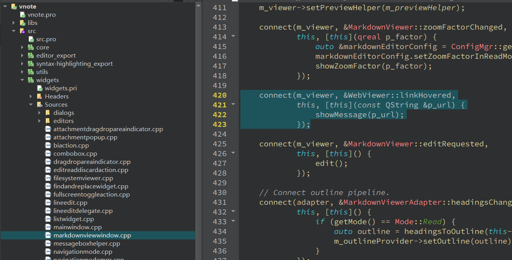

# vnote3代码分析
这里网络不太好，终于下载完了，先不管版本控制了，直接开始看代码。

## 编译运行

ok运行成功。

直接开始改。

## 提示栏显示url链接

vnote2有显示，但是3还没有，看看能不能加上。


[链接](file:///C:/Users/tootal/Documents/vnote_notebooks/notebook/Markdown测试.md#标题)


先从v2开始分析吧。

这是一个悬浮事件（hover）

先搜索一下`addEventListener(`，看看有没有线索。

没有什么发现，注意到在链接上右键可以显示不同的菜单！


从这里入手查找。

直接找`View Link`


定位到文件：


看了一下也没什么发现。

继续查Qt的悬浮事件：`QEvent::HoverEnter`

压根没用到这个。。

那只能从状态栏入手了。

查了一下，在状态栏显示消息需要调用`->showMessage`

查到了封装的接口：

```cpp
void VMainWindow::showStatusMessage(const QString &p_msg)
{
    const int timeout = 5000;
    statusBar()->showMessage(p_msg, timeout);
}

```

这就挺多的了，懒得一个个看了，用正则过滤一下，显示的url肯定不需要翻译，所以不用套一个`tr`函数。

用[零宽度断言](https://www.cnblogs.com/onepixel/articles/7717789.html)可以做到这一点。

```reg
showStatusMessage\((?!tr\()
```

终于找到线索了。

> 当我们鼠标在页面内移动，移动到链接上会产生 linkHovered()信号

果然，马上就找到了连接了信号槽。

```cpp
connect(page, &QWebEnginePage::linkHovered,
        this, &VMdTab::statusMessage);
```

看看文档。

后面的就简单了，看看 linkHovered 的文档。


然后是找一下类似的代码。

找了几个之前的代码在新版里都没有，果然是大重构。

那直接从QWebEngineView开始看看。
linkHovered也有。

已经找到相关代码。



看样子已经实现了，为啥不显示呢？

搞错了，有显示。。。不过我之前没看到。。


这个就先告一段落。。。

## 加入命令执行功能


首先注意到可以新建其他类型的文件，例如一个C++的hello world文件。


注意上面的图标变化了。

先看看怎么变得。


分析了一下大概懂了。


Markdown文件打开的是markdownviewwindow，其他的是textviewwindow。


感觉在这里加一个可以：


暂时先参考SublimeText的build功能了。

[参考文档](https://www.sublimetext.com/docs/3/build_systems.html)

现在网络好卡。。。

先加个图标试试水吧。


就搜`Import And Export`应该可以找到菜单怎么加的。

参考一下导入导出怎么写的吧。

```cpp
// Import and export.
{
    auto act = tb->addAction(generateIcon("import_export_menu.svg"), MainWindow::tr("Import And Export"));

    auto btn = dynamic_cast<QToolButton *>(tb->widgetForAction(act));
    Q_ASSERT(btn);
    btn->setPopupMode(QToolButton::InstantPopup);
    btn->setProperty(PropertyDefs::s_toolButtonWithoutMenuIndicator, true);

    auto newMenu = WidgetsFactory::createMenu(tb);
    btn->setMenu(newMenu);

    // Import file.
    newMenu->addAction(MainWindow::tr("Import File"),
                       newMenu,
                       []() {
                           emit VNoteX::getInst().importFileRequested();
                       });

    // Import folder.
    newMenu->addAction(MainWindow::tr("Import Folder"),
                       newMenu,
                       []() {
                           emit VNoteX::getInst().importFolderRequested();
                       });
}
```

忽然发现New Note菜单的形式更适合一些，可以用于执行默认命令。


不贴代码了。

图标先随便选一个吧。。

先搞几个常用的Build吧。


还要跨平台，确实有难度。。


成了，虽然功能还没写，至少把图标加上去了。


今天先把打开命令行窗口实现了。

启动记事本倒是可以，但命令行窗口就是启动不了。

尝试加一个命令行窗口界面吧。。。


类似与这样的。

窗口启动代码：

```cpp
case ViewWindowToolBarHelper::FindAndReplace:
{
    act = ViewWindowToolBarHelper::addAction(p_toolBar, p_action);
    connect(act, &QAction::triggered,
            this, [this]() {
                if (findAndReplaceWidgetVisible()) {
                    hideFindAndReplaceWidget();
                } else {
                    showFindAndReplaceWidget();
                }
            });
    break;
}
```

终于找到合适的地方了，用Dock好像比较合适。

```cpp
void MainWindow::setupDocks()
{
    setTabPosition(Qt::LeftDockWidgetArea, QTabWidget::West);
    setTabPosition(Qt::RightDockWidgetArea, QTabWidget::East);
    setTabPosition(Qt::TopDockWidgetArea, QTabWidget::North);
    setTabPosition(Qt::BottomDockWidgetArea, QTabWidget::North);
    setDockNestingEnabled(true);
```


TODO: setContentAreaExpanded略有问题。


先不管命令行了，把主要部分：调用接口写好来。


## Sublime的Build配置文件

C++ Single File.sublime-build

```
{
	"shell_cmd": "g++ \"${file}\" -o \"${file_path}/${file_base_name}\"",
	"file_regex": "^(..[^:]*):([0-9]+):?([0-9]+)?:? (.*)$",
	"working_dir": "${file_path}",
	"selector": "source.c++",

	"variants":
	[
		{
			"name": "Run",
			"shell_cmd": "g++ \"${file}\" -o \"${file_path}/${file_base_name}\" && \"${file_path}/${file_base_name}\""
		}
	]
}
```

## git版本控制

修改得有点多了，还是把repo克隆下来。

用gitee导入试试。

果然快多了。

```
PS C:\Users\tootal\Documents\Projects> git clone https://github.com/vnotex/vnote.git
Cloning into 'vnote'...
remote: Enumerating objects: 155, done.
remote: Counting objects: 100% (155/155), done.
remote: Compressing objects: 100% (101/101), done.
fatal: index-pack failed(3563/16519), 4.29 MiB | 14.00 KiB/s
fetch-pack: unexpected disconnect while reading sideband packet
PS C:\Users\tootal\Documents\Projects> git clone https://gitee.com/tootal/vnote.git
Cloning into 'vnote'...
remote: Enumerating objects: 16519, done.
remote: Counting objects: 100% (16519/16519), done.
remote: Compressing objects: 100% (3899/3899), done.
remote: Total 16519 (delta 12497), reused 16519 (delta 12497), pack-reused 0 eceiving objects: 100% (16519/16519), 21.51Receiving objects: 100% (16519/16519), 23.
88 MiB | 1.96 MiB/s, done.
Resolving deltas: 100% (12497/12497), done.
```

看看这差距。

子模块也改一改。


## 参考themes的生成与加载

