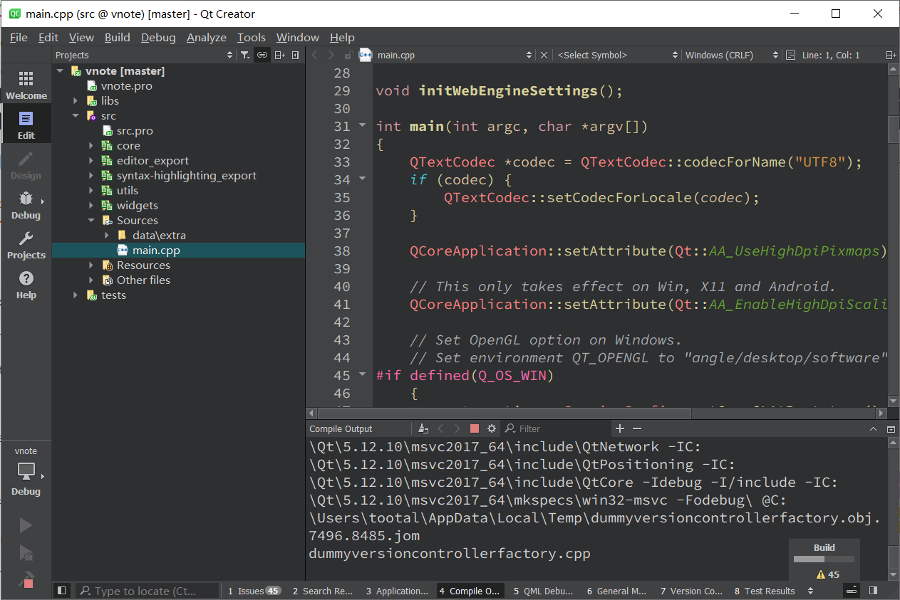
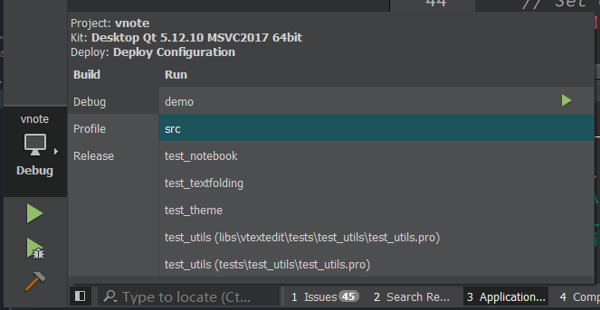
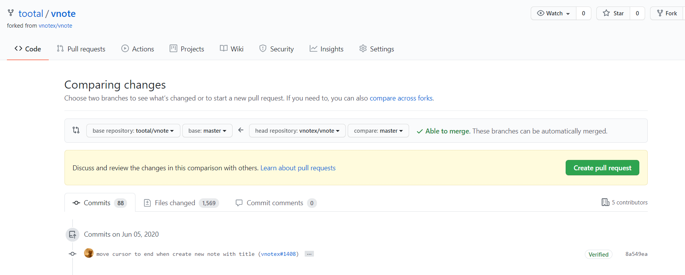
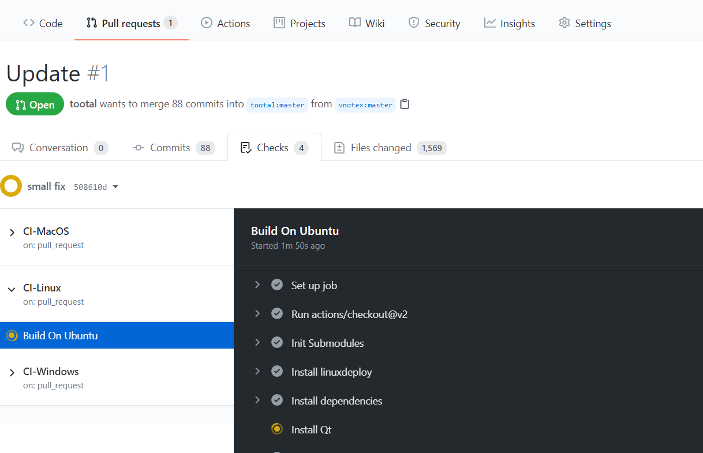
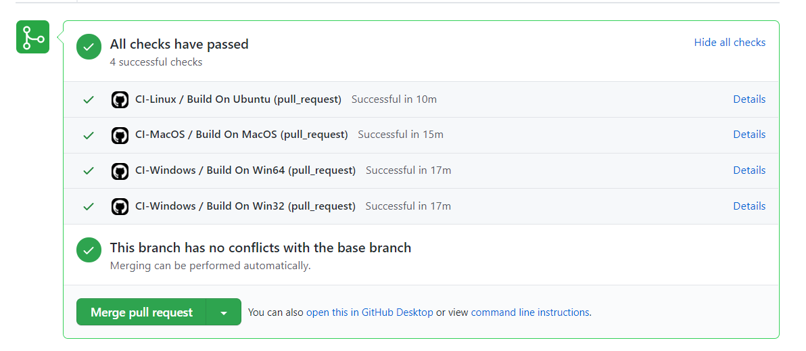
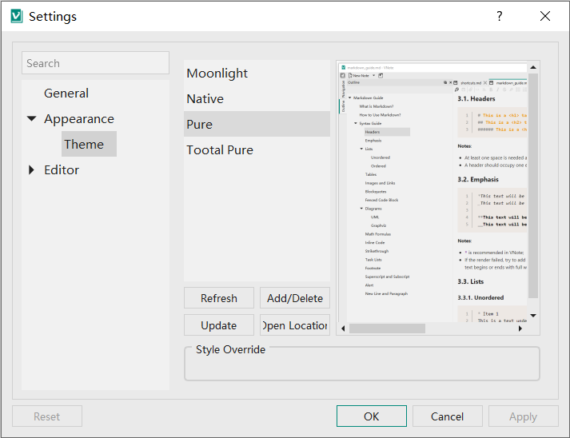
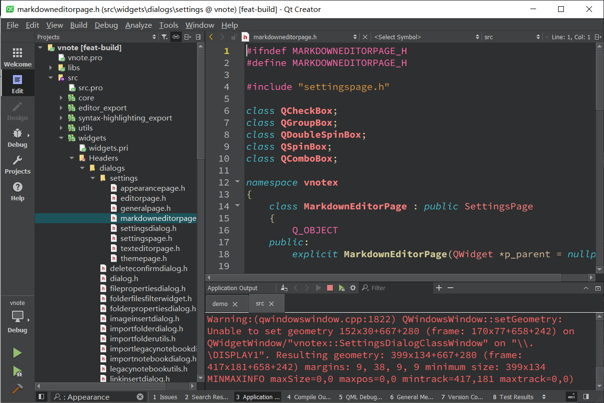
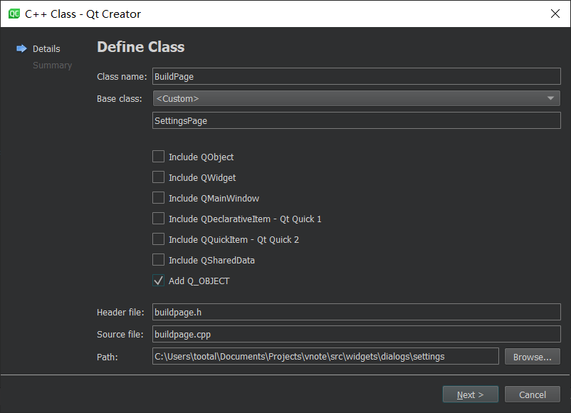
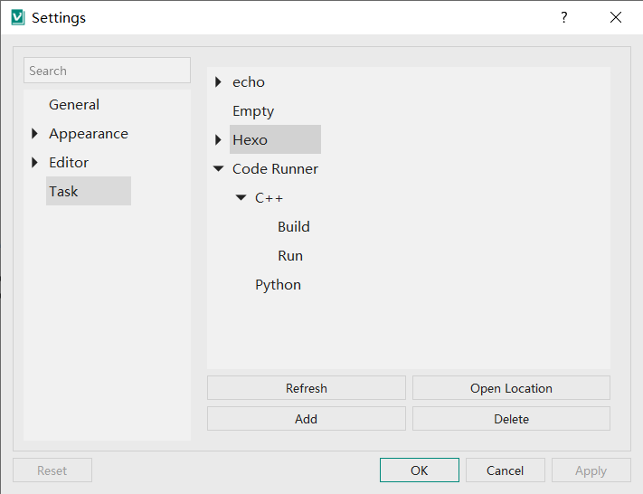
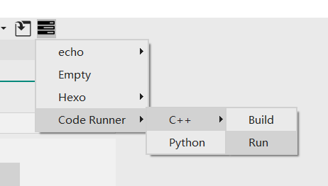

# vnote3构建系统开发

## 下载代码
首先克隆代码仓库，网速较慢可以通过gitee中转一下。注意下面的gitee的网址是我同步的，并不是最新的。可以自己同步一下。

```
PS C:\Users\tootal\Documents\Projects> git clone https://gitee.com/tootal/vnote.git
Cloning into 'vnote'...
remote: Enumerating objects: 16519, done.
remote: Counting objects: 100% (16519/16519), done.
remote: Compressing objects: 100% (3899/3899), done.
remote: Total 16519 (delta 12497), reused 16519 (delta 12497), pack-reused 0 eceiving objects: 100% (16519/16519), 21.51Receiving objects: 100% (16519/16519), 23.
88 MiB | 1.96 MiB/s, done.
Resolving deltas: 100% (12497/12497), done.
```

还需要下载子模块。

同样切换子模块的url以加速下载：

```
git config submodule."libs/vtextedit".url https://gitee.com/tootal/vtextedit
```

代码没有任何变化，只是更改了本地的git设置。（`.git/config`）

```
[core]
	repositoryformatversion = 0
	filemode = false
	bare = false
	logallrefupdates = true
	symlinks = false
	ignorecase = true
[remote "origin"]
	url = https://gitee.com/tootal/vnote.git
	fetch = +refs/heads/*:refs/remotes/origin/*
[branch "master"]
	remote = origin
	merge = refs/heads/master
[submodule "libs/vtextedit"]
	url = https://gitee.com/tootal/vtextedit

```

根目录下的`.gitsubmodule`文件不变。

初始化子模块。

```
PS C:\Users\tootal\Documents\Projects\vnote> git submodule init
PS C:\Users\tootal\Documents\Projects\vnote> git submodule update
Cloning into 'C:/Users/tootal/Documents/Projects/vnote/libs/vtextedit'...
Submodule path 'libs/vtextedit': checked out '3e45827ae9a662bdc61da1090f4e51fdff24af85'  
```

进入子模块目录。

```
PS C:\Users\tootal\Documents\Projects\vnote> cd .\libs\vtextedit\
PS C:\Users\tootal\Documents\Projects\vnote\libs\vtextedit> git log      
commit 3e45827ae9a662bdc61da1090f4e51fdff24af85 (HEAD, origin/master, origin/HEAD, master)
Author: Le Tan <tamlokveer@gmail.com>
Date:   Fri Jan 8 20:16:24 2021 +0800

    refine table support

commit 69bd57656ccac8cf75502506be0c87d80d86e577
Author: Le Tan <tamlokveer@gmail.com>
Date:   Thu Jan 7 20:20:19 2021 +0800
```

注意还有嵌套的子模块，同样使用gitee的url，初始化。

```
PS C:\Users\tootal\Documents\Projects\vnote\libs\vtextedit> git config submodule."src/libs/syntax-highlighting".url https://gitee.com/tootal/syntax-highlighting
PS C:\Users\tootal\Documents\Projects\vnote\libs\vtextedit> git submodule update --init        
Cloning into 'C:/Users/tootal/Documents/Projects/vnote/libs/vtextedit/src/libs/syntax-highlighting'...
Submodule path 'src/libs/syntax-highlighting': checked out '0f63ff8ce3f7135ffafd62bc464c355960f56cfd'
```

下载的速度真的快了非常多。

## 编译代码

用QtCreator打开pro文件，编译运行。

注意选Qt5.12，应该没什么问题。



大概要编译个几分钟。

默认运行的是vtextedit的demo，可以切换。



导入了一个测试的笔记。

看了一下感觉效果还不错。

## 同步github
虽然下载用的是gitee，但是要用github的acton进行持续构建，所以还是同步到github一份。

我之前fork过，所以在网页上更新一下。



合并要一些事件，因为还有运行一些CI。



不过是从原仓库合并的，肯定没问题的。

差不多花了20分钟。。。



然后是切换remote url。切换到feat-build分支。

```
PS C:\Users\tootal\Documents\Projects\vnote> git remote set-url origin https://github.com/tootal/vnote
error: switch `b' requires a value
PS C:\Users\tootal\Documents\Projects\vnote> git checkout -b feat-build
Switched to a new branch 'feat-build'
PS C:\Users\tootal\Documents\Projects\vnote> git branch
* feat-build
  master
```

## 配置文件

整个构建系统主要参考sublimetext的[build system](https://www.sublimetext.com/docs/3/build_systems.html)

配置文件参考themes，在builds文件夹下采用单个文件以`json`为后缀作为配置文件。

一个最简单的配置文件：

```json
{
    "cmd": "echo hello world!"
}
```


忽然发现vscode的[tasks](https://code.visualstudio.com/Docs/editor/tasks)好像也不错。


## 在设置中加载配置文件
终于开始修改代码了。



这里的根路径下添加一个Build。

很容易定位到代码位置。


照葫芦画瓢改就行了。



应该使用TreeWidget。


## 修复bug
目前的目标是能正常运行程序，不崩溃。

ok，果然是没有调用initBuildMgr。

提交一下。

接下来的目标是先看看vscode的task系统。

## 参考vscode的task配置

[完整的定义](https://code.visualstudio.com/docs/editor/tasks-appendix)


简要写了一个超级简单的配置文件，先按照这个来实现。

```ts
interface TaskConfiguration extends TaskDescription {
  /**
   * The configuration's version number
   */
  version: '0.1.0';
}

interface TaskDescription {
  /**
   * The command to be executed. Can be an external program or a shell
   * command.
   */
  command: string;

  /**
   * The task's name. Can be omitted.
   */
  label?: string;

  /**
   * The configuration of the available tasks.
   */
  tasks?: TaskDescription[];
}
```

根task的默认label就是文件名，子label默认用数字从0开始编号。

算了，不纠结json注释的问题了，好好写GUI界面，就不用去直接改json文件了。

一个最简单的json文件。

```json
{
    "version": "0.1.0",
    "command": "echo hello world!"
}
```


一个略复杂的json文件。常用Hexo命令。

```json
{
    "version": "0.1.0",
    "label": "Hexo",
    "tasks": [
        {
            "label": "Generate",
            "command": "hexo generate"
        },
        {
            "label": "Clean",
            "command":"hexo clean"
        },
        {
            "label": "Deploy",
            "command":"hexo deploy"
        },
        {
            "label": "Server",
            "command":"hexo server"
        }
    ]
}
```

同样的给出一个多层嵌套的例子，用于代码运行命令。


更新后的配置文件：

```ts
interface TaskConfiguration extends TaskDescription {
  /**
   * The configuration's version number
   */
  version?: '0.1.1';
}

interface TaskDescription {
  /**
   * The command to be executed. Can be an external program or a shell
   * command.
   */
  command?: string;

  /**
   * The task's name. Can be omitted.
   */
  label?: string;

  /**
   * The configuration of the available tasks.
   */
  tasks?: TaskDescription[];
}

```

没有新增内容，规定一下默认值的处理方法：

version，不指定则采用最新的version。
command，不指定则不运行。
label，默认采用文件名，子task采用数字编号（0-index）
tasks，指定子task。

再来几个例子：

（多层嵌套的）

```json
{
    "version": "0.1.1",
    "label": "Code Runner",
    "tasks": [
        {
            "label": "C++",
            "tasks": [
                {
                    "label": "Build",
                    "command": "g++ $fileName -o $fileNameWithoutExt"
                },
                {
                    "label": "Run",
                    "command": "$dir$fileNameWithoutExt"
                }
            ]
        },
        {
            "label": "Python",
            "command":"python $fileName"
        }
    ]
}
```


同时指定command和子command的。

```json
{
    "version": "0.1.1",
    "label": "Code Runner",
    "tasks": [
        {
            "label": "C++",
            "command": "g++ $fileName -o $fileNameWithoutExt && $dir$fileNameWithoutExt",
            "tasks": [
                {
                    "label": "Build",
                    "command": "g++ $fileName -o $fileNameWithoutExt"
                },
                {
                    "label": "Run",
                    "command": "$dir$fileNameWithoutExt"
                }
            ]
        },
        {
            "label": "Python",
            "command":"python $fileName"
        }
    ]
}
```

显示在界面上应该要是一个多级菜单的形式（子task作为子菜单，label作为显示的名称，点击菜单执行command）

最后写一个简单的吧。

```json
{
    "tasks": [
        {
            "command": "echo 0"
        },
        {
            "command":"echo 1"
        },
        {
            "command":"echo 2"
        }
    ]
}
```

以及一个最简单的：

```json
{}
```

注意，根据默认值的规则，即使这里面什么都没有，但其实version是采用最新的，label为文件名，所以还是会创建一个菜单项目。

## 加载配置文件

先放入一些默认的配置文件吧。

一个task就是task文件夹下的一个json文件，可以包含多个子task，可以嵌套多层。

里面的变量先不解析，后面再说。


还是放到用户的配置文件里测试吧，不加入版本控制系统。

子task的label未设置的话是undefined。

算了，就用空的。



算是达到效果了吧。

## 显示主界面菜单

先做界面吧，功能后面再做。





界面差不多就是这个样子了。。

## 主要功能

先暂时不写设置界面了，写主要功能。

## 变量


在VNote2中的[模板](https://vnotex.github.io/vnote/zh_cn/#!docs/%E7%94%A8%E6%88%B7/%E6%A8%A1%E6%9D%BF.md)功能也用到了变量，可以参考一下。

vscode的[变量](https://code.visualstudio.com/docs/editor/variables-reference)

先从中选取一部分进行支持吧。

```
${notebookFolder} - the path of the notebook opened in VS Code
${file} - the current opened file
${fileBasename} - the current opened file's basename
${fileBasenameNoExtension} - the current opened file's basename with no file extension
${fileDirname} - the current opened file's dirname
${fileExtname} - the current opened file's extension
```


暂时先支持这些吧。

[Input variables](https://code.visualstudio.com/docs/editor/variables-reference#_input-variables)

这个功能很好啊。

暂时不管了，先搞个简单的。

只替换命令中的变量。

当前文件路径。

```
win->getBuffer()->getPath()
```


现在已经差不多达到可用的状态栏。

暂时先不处理空格的问题。

先支持一下


## Code Runner测试

```
PS C:\Users\tootal\Documents\code> cd "c:\Users\tootal\Documents\code\" ; if ($?) { g++ a b.cpp -o a b -DLOCAL -std=gnu++17 -O2 -Wall -Wextra -pedantic -Wshadow -Wformat=2 -Wfloat-equal -Wconversion -Wlogical-op -Wshift-overflow=2 -Wduplicated-cond } ; if ($?) { .\a b }
g++.exe: error: a: No such file or directory
g++.exe: error: b.cpp: No such file or directory
g++.exe: error: b: No such file or directory
g++.exe: fatal error: no input files
compilation terminated.
```

看到连vscode的扩展coderunner也无法正确处理带空格的文件，那我就放心了。。。


应该还是有办法的，我先加入cwd选项，可以大幅度简短命令。

配置文件：

目前新增了很多选项。

```
interface TaskConfiguration extends TaskDescription {
    /**
     * The configuration's version number
     */
    version?: '0.1.1';
}

interface TaskDescription {
    /**
     * The type of a custom task. Tasks of type "shell" are executed
     * inside a shell (e.g. bash, cmd, powershell, ...)
     * If omitted `shell` is used.
     */
    type?: 'shell' | 'process';

    /**
     * The command to be executed. Can be an external program or a shell
     * command. Can be omitted.
     */
    command?: string;

    /**
     * The arguments passed to the command. Can be omitted.
     */
    args?: string[];

    /**
     * The task's name.
     * If root label omitted the file name is used.
     */
    label?: string;

    /**
      * The command options used when the command is executed. Can be omitted.
      */
    options?: CommandOptions;

    /**
     * The configuration of the available tasks.
     */
    tasks?: TaskDescription[];
}

/**
 * Options to be passed to the external program or shell
 */
export interface CommandOptions {
    /**
     * The current working directory of the executed program or shell.
     * If omitted try the following valus in turn.
     * - the current notebook's root
     * - the directory of current file
     * - the directory of executing task file
     */
    cwd?: string;

    /**
     * The environment of the executed program or shell. If omitted
     * the parent process' environment is used.
     */
    env?: { [key: string]: string };

    /**
     * Configuration of the shell when task type is `shell`
     */
    shell?: {
        /**
         * The shell to use. 
         * If omitted, the OS-specific shell is used.
         * - `cmd.exe` for windows
         * - `/bin/bash` for linux or macOS
         */
        executable: string;

        /**
         * The arguments to be passed to the shell executable to run in command mode.
         * If omitted, the default value is used.
         * - ['/D', '/S', '/C'] for `cmd.exe`
         * - ['-c'] for `/bin/bash`
         */
        args?: string[];
    };
}

```


还有一个挺关键的，当子task未指定选项时，尝试从父task继承选项。

现在功能已经有了，还需要继续完善。

用一个TaskConfig类来处理json对象吧。

继续改一下配置文件，支持多平台以及多语言。


单元测试也要开始写了。

TaskConfig类是用来处理配置文件的，就是不知道运行时环境可以解析出来的配置。

locale和platform倒是可以预先传递。


## Open测试

```
PowerShell.exe -Command "& explorer.exe /select, C:\Users\tootal\Documents\vnote_notebooks\testtask\note.md"
```


## 转义行为

如果命令和参数同时指定，则当含有空格时，在两侧加双引号。

```
PowerShell.exe -Command "& code.cmd "C:\Users\tootal\Documents\vnote_notebooks\testtask\test space\测试.md""
cmd.exe /D /S /C "explorer.exe /select," "C:\\Users\\tootal\\Documents\\vnote_notebooks\\testtask\\test space\\测试.md"
cmd.exe /D /S /C explorer.exe /select, C:\Users\tootal\Documents\vnote_notebooks\testtask\test space\测试.md 
PowerShell.exe -Command \"& start vim.exe \"C:\\Users\\tootal\\Documents\\vnote_notebooks\\testtask\\test space\\娴嬭瘯.md\" "
```

## PowerShell

cmd和PowerShell中的start不是同一个东西

```
PS C:\Users\tootal> help start

NAME
    Start-Process

SYNTAX
    Start-Process [-FilePath] <string> [[-ArgumentList] <string[]>] [-Credential <pscredential>] [-WorkingDirectory <st
    ring>] [-LoadUserProfile] [-NoNewWindow] [-PassThru] [-RedirectStandardError <string>] [-RedirectStandardInput <str
    ing>] [-RedirectStandardOutput <string>] [-WindowStyle {Normal | Hidden | Minimized | Maximized}] [-Wait] [-UseNewE
    nvironment] [-WhatIf] [-Confirm] [<CommonParameters>]

    Start-Process [-FilePath] <string> [[-ArgumentList] <string[]>] [-WorkingDirectory <string>] [-PassThru] [-Verb <st
    ring>] [-WindowStyle {Normal | Hidden | Minimized | Maximized}] [-Wait] [-WhatIf] [-Confirm] [<CommonParameters>]


PARAMETERS
    -ArgumentList <string[]>

        Required?                    false
        Position?                    1
        Accept pipeline input?       false
        Parameter set name           (All)
        Aliases                      Args
        Dynamic?                     false
        Accept wildcard characters?  false

    -Confirm

        Required?                    false
        Position?                    Named
        Accept pipeline input?       false
        Parameter set name           (All)
        Aliases                      cf
        Dynamic?                     false
        Accept wildcard characters?  false

    -Credential <pscredential>

        Required?                    false
        Position?                    Named
        Accept pipeline input?       false
        Parameter set name           Default
        Aliases                      RunAs
        Dynamic?                     false
        Accept wildcard characters?  false

    -FilePath <string>

        Required?                    true
        Position?                    0
        Accept pipeline input?       false
        Parameter set name           (All)
        Aliases                      PSPath, Path
        Dynamic?                     false
        Accept wildcard characters?  false

    -LoadUserProfile

        Required?                    false
        Position?                    Named
        Accept pipeline input?       false
        Parameter set name           Default
        Aliases                      Lup
        Dynamic?                     false
        Accept wildcard characters?  false

    -NoNewWindow

        Required?                    false
        Position?                    Named
        Accept pipeline input?       false
        Parameter set name           Default
        Aliases                      nnw
        Dynamic?                     false
        Accept wildcard characters?  false

    -PassThru

        Required?                    false
        Position?                    Named
        Accept pipeline input?       false
        Parameter set name           (All)
        Aliases                      None
        Dynamic?                     false
        Accept wildcard characters?  false

    -RedirectStandardError <string>

        Required?                    false
        Position?                    Named
        Accept pipeline input?       false
        Parameter set name           Default
        Aliases                      RSE
        Dynamic?                     false
        Accept wildcard characters?  false

    -RedirectStandardInput <string>

        Required?                    false
        Position?                    Named
        Accept pipeline input?       false
        Parameter set name           Default
        Aliases                      RSI
        Dynamic?                     false
        Accept wildcard characters?  false

    -RedirectStandardOutput <string>

        Required?                    false
        Position?                    Named
        Accept pipeline input?       false
        Parameter set name           Default
        Aliases                      RSO
        Dynamic?                     false
        Accept wildcard characters?  false

    -UseNewEnvironment

        Required?                    false
        Position?                    Named
        Accept pipeline input?       false
        Parameter set name           Default
        Aliases                      None
        Dynamic?                     false
        Accept wildcard characters?  false

    -Verb <string>

        Required?                    false
        Position?                    Named
        Accept pipeline input?       false
        Parameter set name           UseShellExecute
        Aliases                      None
        Dynamic?                     false
        Accept wildcard characters?  false

    -Wait

        Required?                    false
        Position?                    Named
        Accept pipeline input?       false
        Parameter set name           (All)
        Aliases                      None
        Dynamic?                     false
        Accept wildcard characters?  false

    -WhatIf

        Required?                    false
        Position?                    Named
        Accept pipeline input?       false
        Parameter set name           (All)
        Aliases                      wi
        Dynamic?                     false
        Accept wildcard characters?  false

    -WindowStyle <ProcessWindowStyle>

        Required?                    false
        Position?                    Named
        Accept pipeline input?       false
        Parameter set name           (All)
        Aliases                      None
        Dynamic?                     false
        Accept wildcard characters?  false

    -WorkingDirectory <string>

        Required?                    false
        Position?                    Named
        Accept pipeline input?       false
        Parameter set name           (All)
        Aliases                      None
        Dynamic?                     false
        Accept wildcard characters?  false

    <CommonParameters>
        This cmdlet supports the common parameters: Verbose, Debug,
        ErrorAction, ErrorVariable, WarningAction, WarningVariable,
        OutBuffer, PipelineVariable, and OutVariable. For more information, see
        about_CommonParameters (https://go.microsoft.com/fwlink/?LinkID=113216).


INPUTS
    None


OUTPUTS
    System.Diagnostics.Process


ALIASES
    saps
    start


REMARKS
    Get-Help cannot find the Help files for this cmdlet on this computer. It is displaying only partial help.
        -- To download and install Help files for the module that includes this cmdlet, use Update-Help.
        -- To view the Help topic for this cmdlet online, type: "Get-Help Start-Process -Online" or
           go to https://go.microsoft.com/fwlink/?LinkID=2097141.

```

层层包裹。。

```
PowerShell.exe -Command "Start-Process cmd.exe -ArgumentList /c, \"echo hello world & pause\""

PowerShell.exe -Command 'Start-Process cmd.exe -ArgumentList /c, "echo hello world & pause"'

PowerShell.exe -Command 'Start-Process cmd.exe -ArgumentList /c, \"echo hello world & pause\"'

PowerShell.exe -Command 'echo \"see you\" '

PowerShell.exe -Command "& echo \"see you\" "
```
