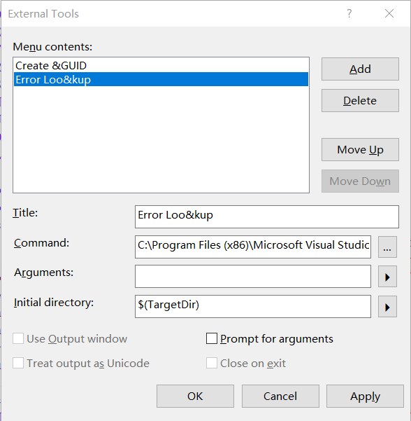
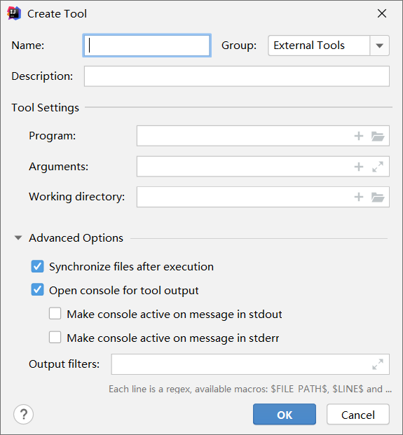
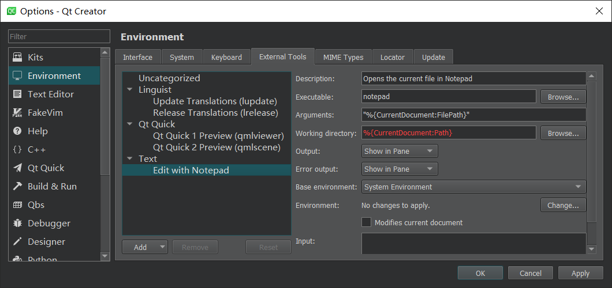
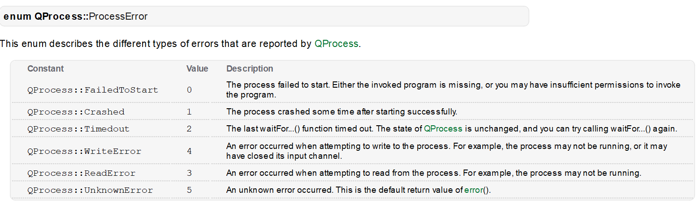
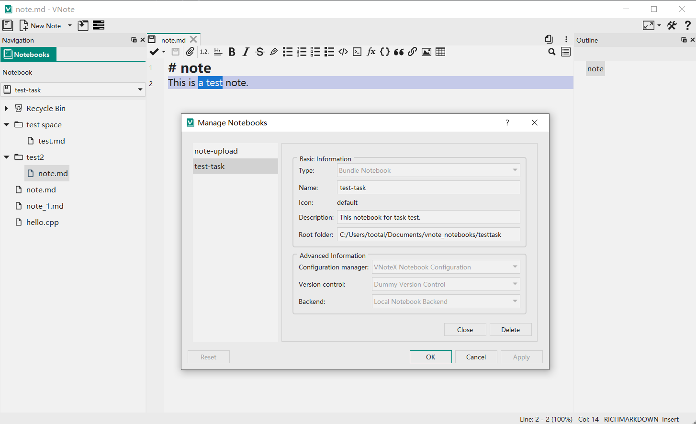
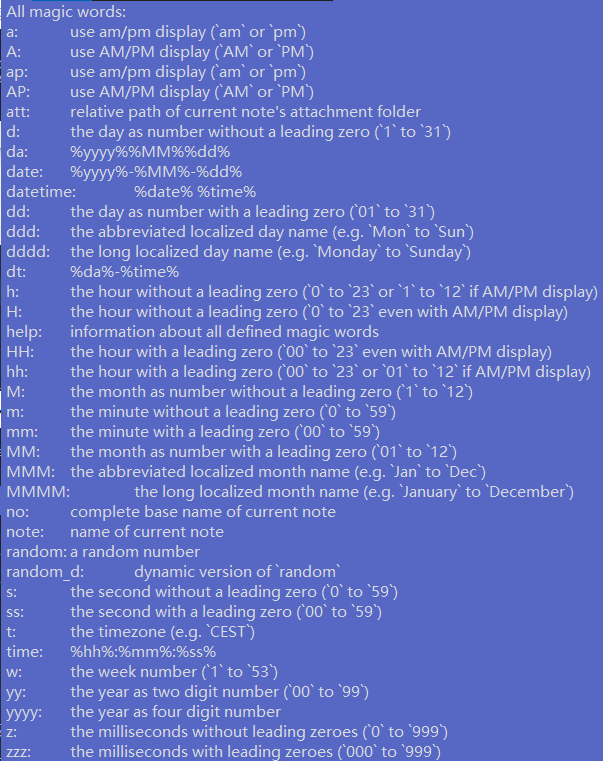
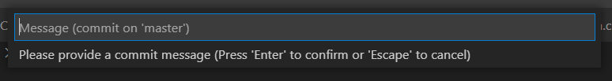
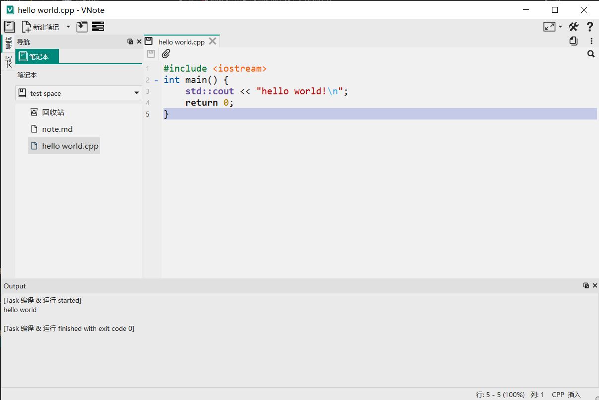

# 给VNote添加任务系统

在记录笔记的过程中，有时会需要执行许多外部工具。例如：

* 通过[Git](https://git-scm.com/)进行笔记的版本控制
* 将多个终端的笔记通过[坚果云](https://help.jianguoyun.com/?p=2064)进行同步
* 将写好的Markdown文档通过[Hexo](https://hexo.io/zh-cn/)渲染预览并发布
* 调用外部编辑器如[Typora](https://typora.io/)或是[VS Code](https://code.visualstudio.com/)进行进一步编辑

这些常用的功能大多可以通过运行命令行工具来完成，鉴于它们的常用性，有必要将其集成在VNote内部，这样无需在需要调用外部工具时输入命令行，或是编写代码。在 [VNote v2.10](https://github.com/vnotex/vnote/releases/tag/v2.10) 时，添加了调用Git的功能。但局限性较大，无法进行扩展。目前许多文本编辑器或是IDE都有执行外部命令的功能，它们的可配置性较高。例如VSCode的[Tasks](https://code.visualstudio.com/docs/editor/tasks) 、Sublime Text的[Build Systems](https://www.sublimetext.com/docs/3/build_systems.html) 、IntelliJ IDEA的[External Tools](https://www.jetbrains.com/help/idea/2020.3/settings-tools-external-tools.html) 、Qt Creator的[External Tools](https://doc.qt.io/qtcreator/creator-editor-external.html) 以及Visual Studio的[External tools](https://docs.microsoft.com/en-us/visualstudio/ide/managing-external-tools?f1url=%3FappId%3DDev16IDEF1%26l%3DEN-US%26k%3Dk(VS.ExternalTools)%26rd%3Dtrue&view=vs-2019) 。VNote的任务系统主要参考的是VSCode的[Tasks](https://code.visualstudio.com/docs/editor/tasks) ，并结合了其它实现的一些优点。

由于VNote [v2版本代码](https://github.com/vnotex/vnote/tree/vnote2.0)不再维护，且v3版本已处于beta阶段，因此任务系统首先考虑在v3版本添加。下面列出的一些功能仅仅是设计阶段的一些想法，并未完全实现。

## 配置方式

要知道运行什么任务、如何运行，必须进行配置。综合来看，目前的配置方式主要分为两大类：编写配置文件、图形化配置界面。其中VSCode采用的是[.vscode/tasks.json](https://code.visualstudio.com/docs/editor/tasks-appendix)配置文件，Sublime Text采用的是[name.sublime-build](https://www.sublimetext.com/docs/3/build_systems.html#options)配置文件，均为类似JSON格式的配置文件。配置文件示例如下所示：

VSCode配置文件：

```json
{
  // See https://go.microsoft.com/fwlink/?LinkId=733558
  // for the documentation about the tasks.json format
  "version": "2.0.0",
  "tasks": [
    {
      "label": "Run tests",
      "type": "shell",
      "command": "./scripts/test.sh",
      "windows": {
        "command": ".\\scripts\\test.cmd"
      },
      "group": "test",
      "presentation": {
        "reveal": "always",
        "panel": "new"
      }
    }
  ]
}
```

Sublime Text配置文件：

```json
{
	"shell_cmd": "g++ \"${file}\" -o \"${file_path}/${file_base_name}\"",
	"file_regex": "^(..[^:]*):([0-9]+):?([0-9]+)?:? (.*)$",
	"working_dir": "${file_path}",
	"selector": "source.c++",

	"variants":
	[
		{
			"name": "Run",
			"shell_cmd": "g++ \"${file}\" -o \"${file_path}/${file_base_name}\" && \"${file_path}/${file_base_name}\""
		}
	]
}

```


其余IDE大多采用图形化配置，如下图所示。








考虑到目前VNote也是主要采用JSON格式的配置文件，因此任务系统也通过JSON文件进行配置。后续会考虑在设置里添加图形化配置方式。

## 配置层次

除了系统默认添加的一些常用任务外，还应该允许用户自行添加一些任务。此外，并不是所有笔记本都需要通过Hexo渲染发布，因此任务系统应该支持分层次的配置文件：

* 全局工具配置：配置文件保存在全局配置文件夹中，软件安装时自动添加。例如`C:\Users\tootal\AppData\Roaming\VNote\VNote\tasks`文件夹下的`*.json`文件。
* 用户工具配置：配置文件保存在用户配置文件夹中，由用户自行添加。例如`C:\Users\tootal\AppData\Local\VNote\VNote\tasks`文件夹下的`*.json`文件。
* 笔记本工具配置：配置文件保存在笔记本文件夹中，由用户自行添加。例如`C:\Users\tootal\Documents\vnote_notebooks\testtask\vx_notebook\tasks`文件夹下的`*.json`文件。


## 运行方式

任务应该允许通过以下方式进行调用：

* 主界面菜单项。在软件主菜单界面添加一个**任务**菜单项，其下列出一些功能以及通过配置文件定义的任务。触发该菜单项即可运行对应的任务。这也是目前主流的做法。
* 快捷键。如果需要频繁运行某个任务，可以为其定义一个快捷键。
* 通用入口。在VNote v2版本中存在的一个功能，类似于VSCode或Sublime Text的快速命令面板，但目前在v3版本尚未迁移。
* 自动调用。默认情况下只有手动触发才能调用工具，但有时在恰当的时机自动运行工具可能会非常方便。例如打开笔记本时自动与云端进行同步，关闭笔记本时自动提交所有修改到版本控制系统。这样不仅缩短了操作流程，还可以避免忘记运行。


## 结果输出

不同于代码编辑器，VNote作为一个笔记软件是没有默认的终端的，因此需要添加一个输出面板来查看输出信息。


当运行错误时，会输出一个错误码，含义如下：




## 变量替换

在配置文件中获取当前运行时的一些参数是非常有用的，例如当前打开的笔记本，正在编辑或查看的文件。参考[VSCode提供的变量](https://code.visualstudio.com/docs/editor/variables-reference)，VNote的任务系统配置同样采用`${variableName}`的语法，计划支持以下变量，其中示例以下图所示的情况为例。




### 预定义变量

* `${notebookFolder}`，当前打开的笔记本文件夹路径，如`C:\Users\tootal\Documents\vnote_notebooks\testtask`。
* `${notebookFolderBasename}`，当前打开的笔记本文件夹名，如`testtask`。
* `${notebookName}`，当前打开的笔记本名，如`test-task`。
* `${notebookDescription}`，当前打开的笔记本描述，如`This notebook for task test.`。
* `${file}`，当前打开的文件路径，如`C:\Users\tootal\Documents\vnote_notebooks\testtask\test2\note.md`。
* `${fileNotebookFolder}`，当前打开的文件所在的笔记本文件夹路径，如`C:\Users\tootal\Documents\vnote_notebooks\testtask`。
* `${relativeFile}`，当前打开的文件相对于`${fileNotebookFolder}`的路径，如`test2\note.md`。
* `${fileBasename}`，当前打开的文件名，如`note.md`。
* `${fileBasenameNoExtension}`，当前打开的文件名（不含扩展名），如`note`。
* `${fileDirname}`，当前打开的文件所在的文件夹路径，如`C:\Users\tootal\Documents\vnote_notebooks\testtask\test2`。
* `${fileExtname}`，当前打开的文件的扩展名（包含点），如`.md`。
* `${cwd}`，当前任务开始运行时的工作目录。
* `${lineNumber}`，当前光标所在处的行号，如`2`。
* `${selectedText}`，当前选中的文本，如`a test`。
* `${execPath}`， VNote可执行文件的路径，如`C:\Programs\vnote3\vnote.exe`。
* `${pathSeparator}`，当前操作系统所用的路径分隔符。

变量基本与VSCode兼容。注意变量替换只在以下配置项中有效：`command`、`args`、`options.cwd`、`options.env`。如果变量的值不存在，则会被替换为空字符串。注意变量中的路径会使用平台相关的路径分隔符。

### 幻词变量

通过`${magic:magic-words}`可以引用幻词变量，所有支持的幻词如下所示。（按字典序排列，与VNote v2兼容）




### 环境变量

可以用`${env:Name}`的语法引用系统定义的环境变量。


### 配置变量

用`${config:core.locale}`的语法引用VNote的配置变量。


### 输入变量
上面的变量在一般情况下已经足够使用，但它们无法在运行时动态调整参数。例如要求在运行`git commit`时手动输入一些信息。参考[VSCode Tasks的Input variables](https://code.visualstudio.com/docs/editor/variables-reference#_input-variables)，VNote同样提供类似的功能。通过`${input:variableID}`的语法可以引用一个输入变量。


### 命令变量

有些值需要动态获取但不必用户手动输入，此时可以通过`${command:commandString}`的语法使用命令变量。

执行时会先通过系统默认的shell执行commandString，将结果作为变量值进行替换。


## 运行交互


虽然有了输入变量可以进行一定程度的交互，但仍然不能很好的处理一些特殊情况。例如需要多次输入确认、后台运行等。

任务系统没有内置相关功能，但仍然可以通过启动一个额外的窗口来进行操作。

## 任务配置


### 多平台支持
由于不同平台运行工具的命令可能大不相同，配置文件同样支持平台特定配置。

通过`windows`、`linux`以及`osx`可以分别为`Windows`、`Linux`以及`MacOS`平台指定特定的配置。

平台特定配置中的`tasks`会被合并，其余配置会被覆盖。

### 多语言支持

配置文件同样支持多语言，`label`、`inputs.description`、`inputs.default`配置项除直接指定一个字符串外，还可以指定一个`TranslatableString`对象：

```ts
/**
 * Localization
 */
interface TranslatableString {
    en_US?: string,
    zh_CN?: string
}
```


### 转义字符

不同shell有不同的特殊字符。

### 后台任务

## 任务示例

### echo

```json
{
            "label": {
                "en_US": "Select",
                "zh_CN": "选择"
            },
            "command": "if (\"${input:who}\" -eq \"Aladdin\") { echo \"ok\" } else { echo \"\" }",
            "inputs": [
                {
                    "id": "who",
                    "type": "pickString",
                    "description": {
                        "en_US": "Who rubbed the lamp and the giant ran out?",
                        "zh_CN": "谁擦了神灯之后，神灯巨人跑了出来？"
                    },
                    "options": [
                        {
                            "en_US": "Alaga",
                            "zh_CN": "阿拉甲"
                        },
                        {
                            "en_US": "Allay",
                            "zh_CN": "阿拉乙"
                        },
                        {
                            "en_US": "Alabin",
                            "zh_CN": "阿拉丙"
                        },
                        {
                            "en_US": "Aladdin",
                            "zh_CN": "阿拉丁"
                        }
                    ],
                    "default": {
                        "en_US": "Alaga",
                        "zh_CN": "阿拉甲"
                    }
                }
            ]
        }
```

### Git



主要实现的功能有初始化、提交所有、上传、下载。


### Hexo


### Code Runner




## 测试


## 详细配置格式
