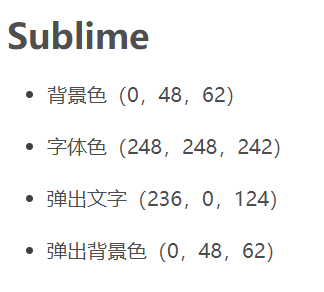

# Windows下的命令行简要配置记录

窗口大小：120*25
字体：[Sarasa Term SC](https://github.com/be5invis/Sarasa-Gothic/releases)
[清华镜像](https://mirrors.tuna.tsinghua.edu.cn/github-release/be5invis/Sarasa-Gothic/)
配色可以使用colortool工具更改，这个工具可以使用scoop安装。

`square.png`
`seti.png`
`royal.png`
`relaxed.png`
`red_planet.png`
`highway.png`

[mbadolato/iTerm2-Color-Schemes](https://github.com/mbadolato/iTerm2-Color-Schemes#installation-instructions)配色仓库。

[详细介绍修改powershell颜色](https://blog.csdn.net/Alisebeast/article/details/89638690?depth_1-utm_source=distribute.pc_relevant.none-task-blog-BlogCommendFromMachineLearnPai2-1&utm_source=distribute.pc_relevant.none-task-blog-BlogCommendFromMachineLearnPai2-1)
[sublime和atom配色](https://blog.csdn.net/A615883576/article/details/81486367?depth_1-utm_source=distribute.pc_relevant.none-task-blog-BlogCommendFromBaidu-1&utm_source=distribute.pc_relevant.none-task-blog-BlogCommendFromBaidu-1)
