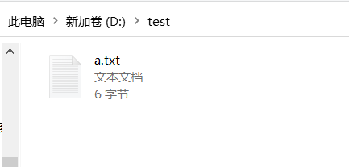

# 硬链接、软链接和符号链接
## 硬链接
硬链接指通过索引节点来进行连接，在Linux为文件系统中，保存在磁盘分区中的文件不管是什么类型都给它分配一个编号，称为索引节点号；
硬链接指的就是在Linux中，多个文件名指向同一索引节点；
常见用途：通过建立硬链接到重要文件，防止误删，删除其实对应的是删除其中的一个硬链接，当文件对应的硬链接都被删除了，该文件才真正被删除；

硬链接类似于编程中的**引用计数**，一个变量可以有多个引用，每个引用的地位都是一样的。

## 软链接、符号链接
也成为符号链接（Symbolic Link），类似于Windows的快捷方式，其中包含的是另一个文件的位置信息

类似编程中的指针，记录变量的地址。


## CMD

```cmd
C:\Users\awesome>mklink /?
创建符号链接。

MKLINK [[/D] | [/H] | [/J]] Link Target

        /D      创建目录符号链接。默认为文件
                符号链接。
        /H      创建硬链接而非符号链接。
        /J      创建目录联接。
        Link    指定新的符号链接名称。
        Target  指定新链接引用的路径
                (相对或绝对)。
```

## Windows实践



### 快捷方式


```cmd
D:\test>type a.txt
123123
D:\test>dir
 驱动器 D 中的卷是 新加卷
 卷的序列号是 3ABB-3FA3

 D:\test 的目录

2020/08/11  21:35    <DIR>          .
2020/08/11  21:35    <DIR>          ..
2020/08/11  21:34                 6 a.txt
2020/08/11  21:35               833 b.txt.lnk
               2 个文件            839 字节
               2 个目录 268,660,256,768 可用字节

D:\test>type b.txt.lnk
（二进制乱码）
```

::: alert-info
源文件和快捷方式是不同的文件，快捷方式（以`.lnk`结尾）仅仅记录源文件的位置信息。（注意这里的位置不是指文件路径，而是在磁盘上的位置，所以即使移动了文件或者更改了文件名，快捷方式仍然有效。源文件删除后，快捷方式失效。
:::

快捷方式本质上是Windows文件管理器提供的一种链接，与之前提到的硬、软链接都不同。所以在命令行是无效的。

### 软链接

```cmd
D:\test>mklink c.txt aa.txt
为 c.txt <<===>> aa.txt 创建的符号链接

```


软链接就是记录源文件的路径了，源文件改名或移动后软链接就失效了。

软链接是更底层的支持，因此支持大部分场景。

```cmd
D:\test>type c.txt
123123
D:\test>type aa.txt
123123
```

### 硬链接
```cmd
D:\test>mklink /h d.txt aa.txt
为 d.txt <<===>> aa.txt 创建了硬链接
```

硬链接看上去和源文件一模一样。


底层是同一个文件，只不过用不同的名字引用而已。

即使删掉源文件，硬链接的文件依然存在。

为了测试硬链接是否占用空间，我找了一个10G的视频文件。


经过对比，创建硬链接后磁盘容量不变。

可以看到，硬链接是非常实用的一种链接。

注意：压缩软件在压缩时一般会处理好符号链接，但不能处理快捷方式。