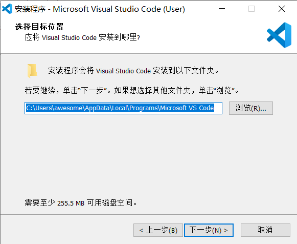
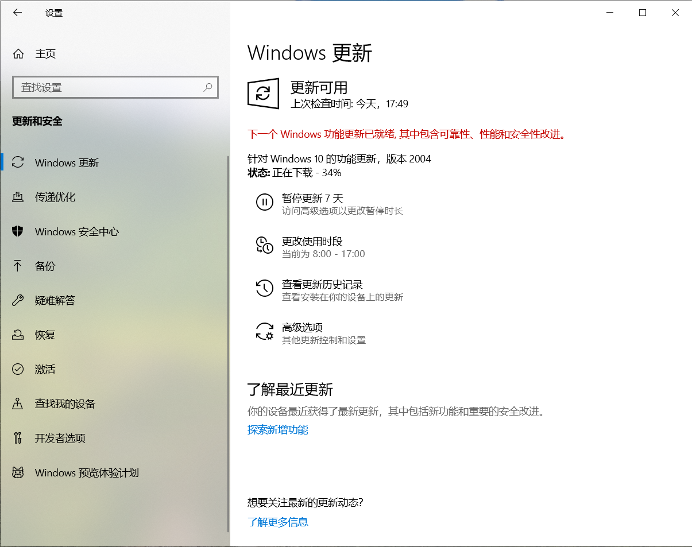

# 系统配置软件安装记录
Typora安装好了。

目前的初步想法就是用来替代记事本的 呵呵呵。

主要当然是因为颜值比记事本高了。

先把笔记本自带的键盘禁用了吧。

接着顺便安装一下VS Code，这个也是必备的。

忽然发现VS Code已经这么大了，要255M空间。。

VS2019安装好了。

再安装QT吧，从清华大学开源软件镜像安装，在线安装容易安装失败。

安装BitComet，现在下载的需求还是比较多的。

终于要更新到2004了。

可能是在下载Windows更新的原因，Qt下载的好慢。

接下来的文件管理策略就是优先放在C盘，D盘以前的 文件就先放在存档文件夹中，慢慢整理了。

装一下scoop吧，感觉git、python、g++还是用scoop安装。注意要锁版本。

要不然python已更新，我装的所有库都没了。

浏览器就先用着Edge吧。

感觉也还挺好用的。

Scoop安装失败了。。。诶。

有点想放弃Scoop了。

等下开热点试一下吧。

如果不行就放弃了。（暂时放弃）

我放弃下载QT了。

Bitcomet也放弃。

很难下载好。就先用我之前保存的安装包吧。

尴尬，好像之前被我删掉了。

只能再下载一遍了。

我现在需要一个下载器。

哎，这次更新总算差不多了（系统更新）

剩下的就是软件更新了。

下次更新、重装电脑一定要到网络好的地方去。

诶，发现Bandizip最新版7.0也要广告了。

直接下载旧版的了。

现在来装一下Java吧，就装JDK8.

下载个Java都要登录，真是.

惊喜的发现自由门还能用，成功安装了Scoop。

网络是真的慢，这次搞完再也不折腾了。（至少过很长一段时间）

终于安装好JAVA了。

QT正在安装。

再也不折腾了。

欲哭无泪。

网速真慢。

打字机模式有点意思。

大概知道这个什么原理了。

打字机模式就是保持当前行在屏幕中央。

专注模式就是让除当前行外的行变成灰色（专注于当前行。）

感觉还是很不错的。

这样果然非常专注了。

接下来安装Python了，这次一定要把版本锁定。

放弃了，直接用安装包，多方便。

Scoop最主要的一个功能就是用来安装gcc的，这次也要锁定版本。

QT安装成功了！！

