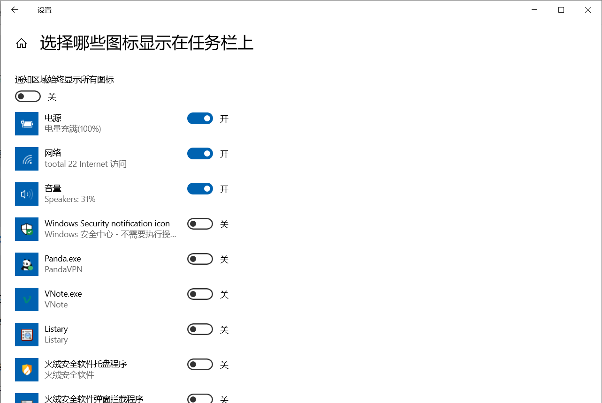

# 隐藏windows defender托盘图标
由于目前已经安装了火绒，想隐藏windows defender的图标。

这里只能收缩到菜单中，不能完全隐藏。

[参考](https://answers.microsoft.com/zh-hans/windows/forum/all/windows-defender/1d51723e-b80c-48aa-8992-a88a79527089#:~:text=如果是这样，您可以,后的开关即可。)

即使关闭图标，defender 依然是正常运行的。关闭方法如下：  
1）右键在桌面底部单机，启动任务管理器。  
2）选择启动项标签  
3）选择将windwos10 defender 通知图标，右键单击，选择禁用。  
4）重启电脑后，图标就不存在了。  
  

If this does not help you, open **Registry Editor** and navigate to the following key:

> HKEY\_CURRENT\_USER\\SOFTWARE\\Microsoft\\Windows\\CurrentVersion\\Run

Create a new string value, name it **Windows Defender** and set its value as follows:

> “%ProgramFiles%\\Windows Defender\\MSASCuiL.exe”-runkey

Restart your computer.

The icon should have been disabled.

  
  

或者在运行中输入 C:\\Program Files\\Windows Defender\\MSASCuil.exe

  
  
作者：弘慎  
链接：https://www.zhihu.com/question/51110506/answer/124147161  
来源：知乎  
著作权归作者所有。商业转载请联系作者获得授权，非商业转载请注明出处。

