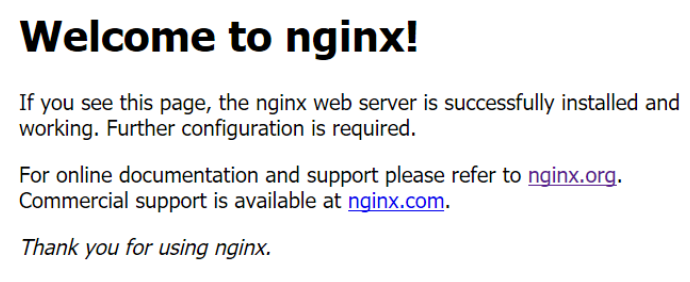
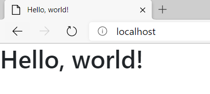
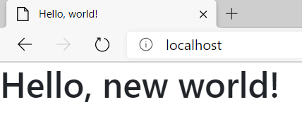
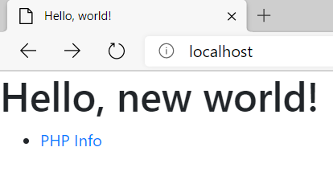
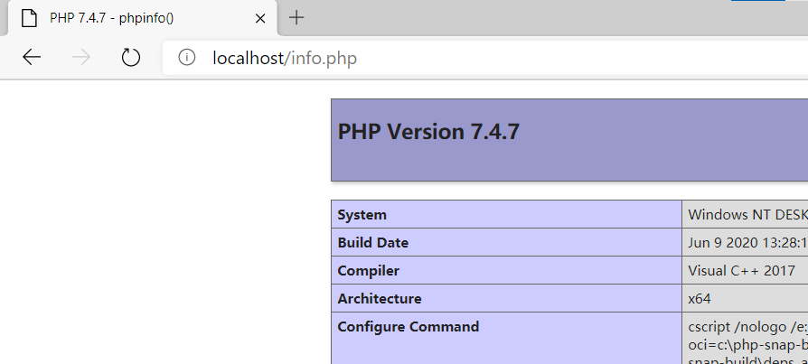
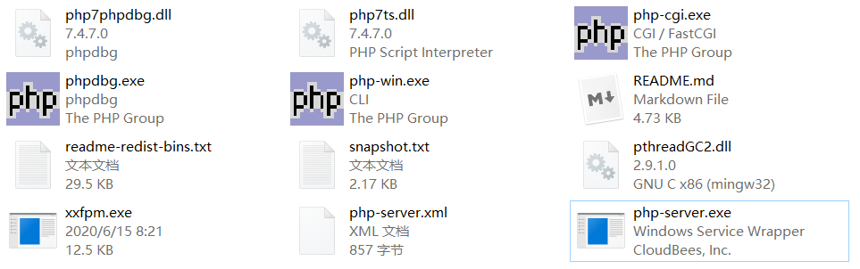
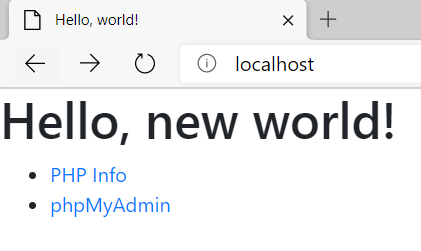
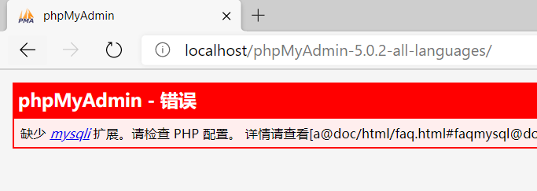
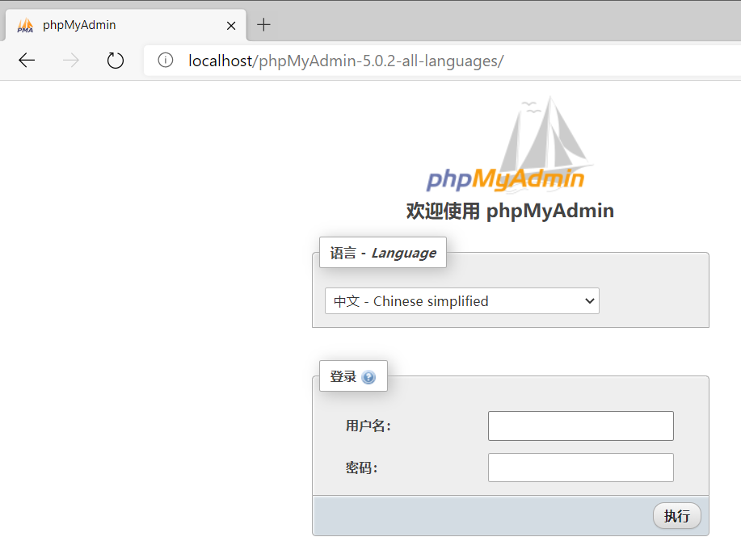
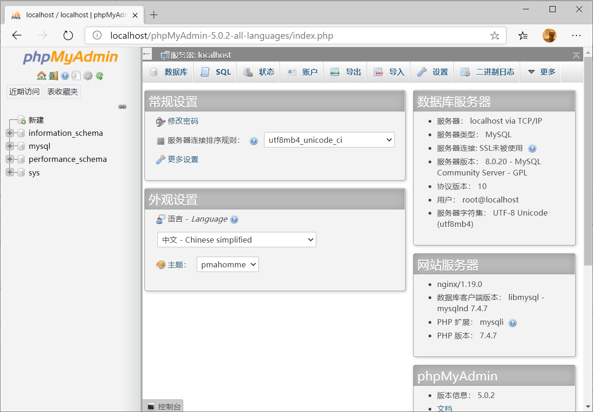

# Windows下Web开发环境搭建
创建日期：20190822
更新日期：20200615

虽然Web程序大多运行在Linux服务器上，从兼容性角度来说，当然是在与服务器一致的环境下开发最好。但是我本地的机器是Windows系统，实在要用Linux的时候是采用虚拟机的方式。在虚拟机里面写代码着实麻烦，因此还是决定在Windows下搭建一套Web开发环境，方便测试。

我选择的Web开发组件是WNMP（Windows+Nginx+MySQL+PHP）。

## Nginx下载安装启动
[Nginx](http://nginx.org/) (engine x) 是一个高性能的HTTP和反向代理web服务器，同时也提供了IMAP/POP3/SMTP服务。目前我主要使用它的HTTP代理功能。在[下载页面](http://nginx.org/en/download.html)可以选择需要的版本下载，用于测试可以选择Mainline version，当前的最新版本是1.19.0。我直接使用[Scoop](https://scoop.sh/)安装。

安装好后在命令行窗口运行：`start nginx`。（注意直接运行`nginx`可能导致命令行无法退出）

如果出现以下错误信息：

```cmd
nginx: [alert] could not open error log file: CreateFile() "logs/error.log" failed (3: The system cannot find the path specified)                                                                                                               2020/06/14 21:39:05 [emerg] 1444#13520: CreateFile() "C:\Users\awesome/conf/nginx.conf" failed (3: The system cannot find the path specified)   
```

说明当前路径不对，需要到安装目录下运行，我这里是[C:\Users\awesome\scoop\apps\nginx\current](file:///C:/Users/awesome/scoop/apps/nginx/current)，或者利用`-p`选项指定安装路径也可以。允许通过防火墙后，就运行成功了。注意命令行界面是没有显示的。可以打开浏览器，访问[http://localhost/](http://localhost/)，如果出现以下画面就说明安装成功了。



如果要停止Nginx，可以输入`nginx -s stop`，官网的简短的[使用说明](http://nginx.org/en/docs/beginners_guide.html)可以参考一下。
## 将Nginx注册成系统服务
如果想让Nginx自动运行，最好的办法是把它注册成系统服务。我这里使用了[winsw](https://github.com/winsw/winsw)这个小工具。在[下载页面](https://github.com/winsw/winsw/releases)选择合适的版本下载，我选的是[WinSW.NET461.exe](https://github.com/winsw/winsw/releases/download/v2.9.0/WinSW.NET461.exe)，可以同时下载一份配置文件[sample-minimal.xml](https://github.com/winsw/winsw/releases/download/v2.9.0/sample-minimal.xml)。

下载好后，参考[这篇博客](https://blog.csdn.net/defonds/article/details/7906005)进行配置。我就简单记录一下我的配置过程。将WinSW.NET461.exe复制一份到[nginx.exe所在目录](file:///C:/Users/awesome/scoop/apps/nginx/current)，重命名为nginx-server.exe，在同目录下创建配置文件nginx-server.xml，内容如下：（[配置文档](https://github.com/winsw/winsw/blob/master/doc/xmlConfigFile.md)）

```xml
<service>
  <id>nginx</id>
  <name>Nginx</name>
  <description>nginx [engine x] is an HTTP and reverse proxy server, a mail proxy server, and a generic TCP/UDP proxy server, originally written by Igor Sysoev. </description>
  <executable>C:\Users\awesome\scoop\apps\nginx\current\nginx.exe</executable>
  <startarguments>-p C:\Users\awesome\scoop\apps\nginx\current</startarguments>
  <stoparguments>-p C:\Users\awesome\scoop\apps\nginx\current -s stop</stoparguments>
</service>
```

在当前目录下**以管理员权限**打开命令提示符运行以下命令安装服务：

```cmd
C:\Users\awesome\scoop\apps\nginx\current>nginx-server.exe install                                                      2020-06-14 22:00:46,957 INFO  - Installing the service with id 'nginx'     
```

在命令行下可以使用sc命令查询服务情况（注意该命令在PowerShell下需要改为sc.exe）：

```cmd
C:\Users\awesome\scoop\apps\nginx\current>sc query nginx                                                                                                                                                                                        SERVICE_NAME: nginx                                                                                                             TYPE               : 10  WIN32_OWN_PROCESS                                                                              STATE              : 1  STOPPED                                                                                         WIN32_EXIT_CODE    : 1077  (0x435)                                                                                      SERVICE_EXIT_CODE  : 0  (0x0)                                                                                           CHECKPOINT         : 0x0                                                                                                WAIT_HINT          : 0x0                                                                                                                                             
```

[sc query命令文档](https://docs.microsoft.com/zh-cn/windows-server/administration/windows-commands/sc-query)

可以看到目前Nginx服务是关闭的，如果之前运行的nginx.exe还在运行可以在任务管理器中结束任务。此时应该是无法访问localhost的了。接下来使用服务运行nginx。

```cmd
C:\Users\awesome\scoop\apps\nginx\current>net start nginx                                                               nginx 服务正在启动 .                                                                                                    nginx 服务已经启动成功。                 
```

或者直接使用sc命令：`sc start nginx`。这两个命令有略微的区别，sc命令会马上退出，此时nginx在等待启动，而net命令则会等到服务启动完成后再退出。

以后系统开机会自动运行Nginx服务，如果想取消可以使用`sc config nginx start= demand`命令改为手动运行。

[sc config命令文档](https://docs.microsoft.com/zh-cn/windows-server/administration/windows-commands/sc-config)，注意等号后面的空格是比不可少的，参考[这里](https://docs.microsoft.com/zh-cn/windows-server/administration/windows-commands/sc-config#remarks)。

## 配置Nginx
### 静态服务
假设现在写了一个简单的html文件，如何让nginx代理我的文件而不是默认的`Welcome to Nginx！`文件呢？下面记录几种方法：

假设HTML文件内容如下（来自[Bootstrap](https://getbootstrap.com/docs/4.5/getting-started/introduction/#starter-template)）

```html
<!doctype html>
<html lang="en">
  <head>
    <!-- Required meta tags -->
    <meta charset="utf-8">
    <meta name="viewport" content="width=device-width, initial-scale=1, shrink-to-fit=no">

    <!-- Bootstrap CSS -->
    <link rel="stylesheet" href="https://stackpath.bootstrapcdn.com/bootstrap/4.5.0/css/bootstrap.min.css" integrity="sha384-9aIt2nRpC12Uk9gS9baDl411NQApFmC26EwAOH8WgZl5MYYxFfc+NcPb1dKGj7Sk" crossorigin="anonymous">

    <title>Hello, world!</title>
  </head>
  <body>
    <h1>Hello, world!</h1>

    <!-- Optional JavaScript -->
    <!-- jQuery first, then Popper.js, then Bootstrap JS -->
    <script src="https://code.jquery.com/jquery-3.5.1.slim.min.js" integrity="sha384-DfXdz2htPH0lsSSs5nCTpuj/zy4C+OGpamoFVy38MVBnE+IbbVYUew+OrCXaRkfj" crossorigin="anonymous"></script>
    <script src="https://cdn.jsdelivr.net/npm/popper.js@1.16.0/dist/umd/popper.min.js" integrity="sha384-Q6E9RHvbIyZFJoft+2mJbHaEWldlvI9IOYy5n3zV9zzTtmI3UksdQRVvoxMfooAo" crossorigin="anonymous"></script>
    <script src="https://stackpath.bootstrapcdn.com/bootstrap/4.5.0/js/bootstrap.min.js" integrity="sha384-OgVRvuATP1z7JjHLkuOU7Xw704+h835Lr+6QL9UvYjZE3Ipu6Tp75j7Bh/kR0JKI" crossorigin="anonymous"></script>
  </body>
</html>
```

保存到如下路径：[C:\Users\awesome\Documents\Projects\www\index.html](file:///C:/Users/awesome/Documents/Projects/www/index.html)，双击html文件，可以正常打开（使用file协议）。在Nginx安装目录附近找一下，可以找到Nginx的HTML文件的[默认位置](file:///C:/Users/awesome/scoop/persist/nginx/html)，把里面的html文件替换即可。

这时候打开localhost出现的就是新创建的HTML文件了。



### 指定文件夹位置

如果不想更改文件夹位置，可以选择更改Nginx的配置，在[conf配置文件夹](file:///C:/Users/awesome/scoop/apps/nginx/current/conf)下有一个文件名为`nginx.conf`的文件。内容大致如下：

```conf
http {
    ...
    server {
        ...
        location / {
            root   html;
            index  index.html index.htm;
        }
    }
}
```

其中root指定的就是网站根目录对应的路径。[root指令文档](https://nginx.org/en/docs/http/ngx_http_core_module.html?&_ga=2.77077269.1296545611.1592147608-197645587.1592147608#root)。其他配置可以参考[Configuring NGINX and NGINX Plus as a Web Server](https://docs.nginx.com/nginx/admin-guide/web-server/serving-static-content/)。

注意：Windows下路径中的`\`需要转义。我这里改成：

```conf
http {
    ...
    server {
        ...
        location / {
            #root   html;
            root C:\\Users\\awesome\\Documents\\Projects\\www;
            index  index.html index.htm;
        }
    }
}
```
为了验证改动生效了，我把标题改成了`Hello, new world!`。重新启动nginx服务（可以先停止、再启动），打开localhost即可查看效果。



如果想再添加一个服务器，可以参考：[Setting Up Virtual Servers](https://docs.nginx.com/nginx/admin-guide/web-server/web-server/#virtual-server)。

实际上，重新加载配置是不需要重新启动Nginx服务的，可以使用`nginx -s reload `来[重新加载](https://docs.nginx.com/nginx/admin-guide/basic-functionality/managing-configuration-files/#reloading-configuration)配置文件。（如果用服务方式启动，不要使用这种方式）

注意：`start nginx`和`net start nginx`两种启动方式不要混用，否则会启动多个nginx实例，造成冲突。

### 子路径映射

有时候，子路径想配置不同的本地路径，此时可以结合location指令和root指令配置，例如我想把`/blog`映射到我的本地博客文件夹，但是本地文件夹并不在[www](file:///C://Users//awesome//Documents//Projects//www)文件夹内。而是在[blog](file:///C://Users//awesome//blog//public)文件夹内，可以添加如下配置。

```conf
location /blog {
    root C:\\Users\\awesome\\blog\\public;
    index index.html;
}
```

访问后出现**404 Not Found**，查看一下[日志文件](file:///C:/Users/awesome/scoop/apps/nginx/current/logs)。

```log
2020/06/27 15:15:35 [error] 10432#5260: *4 CreateFile() "C:\Users\awesome\blog\public/blog" failed (2: The system cannot find the file specified), client: 127.0.0.1, server: localhost, request: "GET /blog HTTP/1.1", host: "localhost", referrer: "http://localhost/"
```

可以发现，虽然我们重新指定了root根目录，但是访问[localhost/blog](http://localhost/blog)变成了访问`C:\Users\awesome\blog\public/blog`，关键就是不想要最后的blog文件夹。如果研究了一下上面的root文档的话，可以发现，访问的目录会变成root+location，文档中也有指出，如果要改变url对应的路径的话，应该用alias指令。

> A path to the file is constructed by merely adding a URI to the value of the `root` directive. If a URI has to be modified, the [alias](https://nginx.org/en/docs/http/ngx_http_core_module.html?&_ga=2.77077269.1296545611.1592147608-197645587.1592147608#alias) directive should be used.

修改一下配置文件即可。

```conf
location /blog {
    alias C:\\Users\\awesome\\blog\\public;
    index index.html;
}
```

### 虚拟服务器

实际开发过程中，往往需要模拟实际环境，将网站部署在根目录下，此时就需要添加多个服务器了。

同样上面的博客，部署到单独的`localhost:1008`下。仔细看一下nginx的配置文件，可以发现里面已经写好了一个模板：

```conf
# another virtual host using mix of IP-, name-, and port-based configuration
#
#server {
#    listen       8000;
#    listen       somename:8080;
#    server_name  somename  alias  another.alias;

#    location / {
#        root   html;
#        index  index.html index.htm;
#    }
#}
```

比如我的就改成：

```conf
server {
    listen       1008;
#    listen       somename:8080;
#    server_name  somename  alias  another.alias;

    location / {
        root   C:\\Users\\awesome\\blog\\public;
        index  index.html index.htm;
    }
}
```

现在就可以在浏览器输入[localhost:1008](http://localhost:1008/)访问了。

### 代理

如果不想输入这么麻烦，比如我想直接输入blog就可以访问到我的本地blog，怎么配置呢？可以通过更改host+修改nginx配置来达成目的。

先把blog映射到和localhost一样，即在host文件中加入一下内容：

```
127.0.0.1 blog
```

接下来在浏览器输入blog，即可和localhost达成一样的效果。

::: alert-info
如果是第一次访问，需要输入完整的URL：`http://blog`，localhost可以直接访问是因为浏览器有缓存，自动加上了http前缀。
:::

现在的问题就简单了，在nginx中利用host匹配server_name即可。

修改nginx.conf如下：

```conf
    server {
        listen       80;
        server_name  localhost;

...

    server {
        listen       80;
        server_name  blog;
```

注意这里用了server_name做区分，就不用指定其他的端口了。

## PHP下载安装运行
PHP即“超文本预处理器”，是一种通用开源脚本语言。PHP是在服务器端执行的脚本语言，与C语言类似，是常用的网站编程语言。PHP独特的语法混合了C、Java、Perl以及 PHP 自创的语法。利于学习，使用广泛，主要适用于Web开发领域。

打开[PHP的下载页面](https://windows.php.net/download)，一般可以选择Non Thread Safe（nts）版本。解压安装好后，在[安装目录下](file:///C:/Users/awesome/scoop/apps/php/current)以管理员权限打开命令提示符，输入命令运行服务：

```cmd
C:\Users\awesome\scoop\apps\php\current>php-cgi.exe -b localhost:9000
```

运行之后同样没有信息显示，按Ctrl+C可以退出。

## Nginx配合PHP
为了验证php服务运行正常，配置一下Nginx，使得它能解析php文件。同样打开nginx.conf，找到下面这段配置：

```conf
#location ~ \.php$ {
#    root           html;
#    fastcgi_pass   127.0.0.1:9000;
#    fastcgi_index  index.php;
#    fastcgi_param  SCRIPT_FILENAME  /scripts$fastcgi_script_name;
#    include        fastcgi_params;
#}
```

改为：

```conf
location ~ \.php$ {
    root C:\\Users\\awesome\\Documents\\Projects\\www;
    fastcgi_pass   127.0.0.1:9000;
    fastcgi_index  index.php;
    fastcgi_param  SCRIPT_FILENAME  $document_root$fastcgi_script_name;
    include        fastcgi_params;
}
```

大概解释一下原理吧。[location指令](https://docs.nginx.com/nginx/admin-guide/web-server/web-server/#configuring-locations)用来定位，`~`表示后面的字符串是一个正则表达式，`\.php$`匹配所有以`.php`结尾的字符串，因此当网址以`.php`结尾时，就会启用下面的配置。前面提到nginx是一个代理服务器，因此它还可以把请求转发到别的服务上，参考[Passing a Request to a Proxied Server](https://docs.nginx.com/nginx/admin-guide/web-server/reverse-proxy/#passing-a-request-to-a-proxied-server)。这里的fastcgi_pass就是其中一种。通常这些服务还需要读取一些其他信息如HTTP请求头、HTTP参数等，这些信息通过参数传递，定义在fastcgi_params文件中，感兴趣可以查看一下Nginx传递了哪些参数。参考[这里](https://nginx.org/en/docs/http/ngx_http_fastcgi_module.html?&_ga=2.80082711.1296545611.1592147608-197645587.1592147608#variables)。`$document_root`等变量是Nginx内置的变量，指向root的地址，其他变量参考[这里](https://nginx.org/en/docs/http/ngx_http_core_module.html?&_ga=2.76485781.1296545611.1592147608-197645587.1592147608#variables)。

为了方便测试，在首页添加一个链接到info.php。

index.html更改内容：

```html
<h1>Hello, new world!</h1>
<ul>
  <li><a href="info.php">PHP Info</a></li>
</ul>
```

同目录下新建info.php，内容：

```php
<?php phpinfo(); ?>
```

显示效果：





说明PHP运行成功。

## 将PHP配置成系统服务
把PHP配置成系统服务可以参考[这里](https://www.jianshu.com/p/5f355f89804a)。同样简单记录一下我的配置方法。先下载[winsw](https://github.com/kohsuke/winsw/releases)和[xxfpm](https://github.com/78/xxfpm)  （winsw记得同时下载配置文件，xxfpm下载源代码即可）  

将下载的xxfpm.exe 和 pthreadGC2.dll 扔进php-cgi.exe所在的目录，同样添加winsw的程序（php-server.exe）和配置文件（php-server.xml）：

```xml
<configuration>
  <id>php</id>
  <name>PHP</name>
  <description>
PHP is a popular general-purpose scripting language that is especially suited to web development.
Fast, flexible and pragmatic, PHP powers everything from your blog to the most popular websites in the world.
</description>
  <executable>C:\Users\awesome\scoop\apps\php\current\xxfpm.exe</executable>
	<startargument>"C:\Users\awesome\scoop\apps\php\current\php-cgi.exe"</startargument>
	<startargument>-n</startargument>
	<startargument>1</startargument>
	<startargument>-i</startargument>
	<startargument>127.0.0.1</startargument>
	<startargument>-p</startargument>
	<startargument>9000</startargument>

	<stopexecutable>taskkill</stopexecutable>
	<stopargument>/F</stopargument>
	<stopargument>/IM</stopargument>
	<stopargument>xxfpm.exe</stopargument>
</configuration>
```

放置好后大概这个效果：



**以管理员权限**运行cmd：

```cmd
C:\Users\awesome\scoop\apps\php\current>php-server.exe install                                                          2020-06-15 08:26:49,876 INFO  - Installing the service with id 'php'     
```

## 用PowerShell查询服务
默认情况下sc命令在PowerShell是不起作用的。

```ps
PS C:\Users\awesome> Get-Alias -name sc                                                                                                                                                                                                         CommandType     Name                                               Version    Source                                    -----------     ----                                               -------    ------                                    Alias           sc -> Set-Content                                                                                                                                          
```

可以看到sc是Set-Content的别名。一种简单的方法是使用sc.exe

```ps
PS C:\Users\awesome> sc.exe query nginx                                                                                                                                                                                                         SERVICE_NAME: nginx                                                                                                             TYPE               : 10  WIN32_OWN_PROCESS                                                                              STATE              : 1  STOPPED                                                                                         WIN32_EXIT_CODE    : 0  (0x0)                                                                                           SERVICE_EXIT_CODE  : 0  (0x0)                                                                                           CHECKPOINT         : 0x0                                                                                                WAIT_HINT          : 0x0       
```

可惜的是sc别名是只读的，没法更改。

```ps
PS C:\Users\awesome> Set-Alias -Name sc -Value sc.exe                                                                   Set-Alias : 别名不可写入，因为别名 sc 为只读别名或常量，无法写入。                                                      所在位置 行:1 字符: 1                                                                                                   + Set-Alias -Name sc -Value sc.exe                                                                                      + ~~~~~~~~~~~~~~~~~~~~~~~~~~~~~~~~                                                                                          + CategoryInfo          : WriteError: (sc:String) [Set-Alias], SessionStateUnauthorizedAccessException                  + FullyQualifiedErrorId : AliasNotWritable,Microsoft.PowerShell.Commands.SetAliasCommand                                                                              
```

查询PHP服务是否正确安装：

```ps
PS C:\Users\awesome> sc.exe query php                                                                                                                                                                                                           SERVICE_NAME: php                                                                                                               TYPE               : 10  WIN32_OWN_PROCESS                                                                              STATE              : 1  STOPPED                                                                                         WIN32_EXIT_CODE    : 1077  (0x435)                                                                                      SERVICE_EXIT_CODE  : 0  (0x0)                                                                                           CHECKPOINT         : 0x0                                                                                                WAIT_HINT          : 0x0     
```

启动PHP服务，注意之前启动的要先关闭。

```ps
PS C:\Users\awesome> sudo net start php                                                                                 php 服务正在启动 .                                                                                                      php 服务已经启动成功。 
```

我这里使用了scoop提供的sudo命令，它可以暂时提升为管理员权限，如果没有这个命令可以再打开一个管理员权限的窗口。

## MySQL安装配置
MySQL是一个关系型数据库管理系统，由瑞典MySQL AB 公司开发，属于 Oracle 旗下产品。MySQL 是最流行的关系型数据库管理系统之一，在 WEB 应用方面，MySQL是最好的 RDBMS (Relational Database Management System，关系数据库管理系统) 应用软件之一。

可以在[下载页面](https://dev.mysql.com/downloads/)选择合适的版本下载安装，如果只需要命令行界面的话可以下载[ZIP包](https://dev.mysql.com/downloads/mysql/)，我同样使用Scoop命令行安装。由于MySQL自带了配置服务，因此安装非常简单，参考以下配置过程：

```ps
PS C:\Users\awesome> sudo mysqld --install mysql --defaults-file="C:\Users\awesome\scoop\apps\mysql\current\my.ini"     Service successfully installed.                                                                                         PS C:\Users\awesome> sudo net start mysql                                                                               mysql 服务正在启动 .                                                                                                    mysql 服务已经启动成功。                                                                                                                                                                                                                        PS C:\Users\awesome> mysql                                                                                              Welcome to the MySQL monitor.  Commands end with ; or \g.                                                               Your MySQL connection id is 8                                                                                           Server version: 8.0.20 MySQL Community Server - GPL                                                                                                                                                                                             Copyright (c) 2000, 2020, Oracle and/or its affiliates. All rights reserved.                                                                                                                                                                    Oracle is a registered trademark of Oracle Corporation and/or its                                                       affiliates. Other names may be trademarks of their respective                                                           owners.                                                                                                                                                                                                                                         Type 'help;' or '\h' for help. Type '\c' to clear the current input statement.                                                                                                                                                                  mysql> SHOW DATABASES;                                                                                                  +--------------------+                                                                                                  | Database           |                                                                                                  +--------------------+                                                                                                  | information_schema |                                                                                                  | mysql              |                                                                                                  | performance_schema |                                                                                                  | sys                |                                                                                                  +--------------------+                                                                                                  4 rows in set (0.01 sec)    
```

如果安装服务失败，可以尝试删除之前的安装文件，如Scoop的persist。
## PHP连接MySQL
首先启用PHP扩展。

打开[PHP安装目录](file:///C:/Users/awesome/scoop/apps/php/current)，首先需要设置一下[PHP的配置文件](https://www.php.net/configuration.file)。找到`php.ini-development`文件，将它复制一份改名为`php.ini`。更改以下几个地方：

启用扩展目录：

```ini
; Directory in which the loadable extensions (modules) reside.
; http://php.net/extension-dir
;extension_dir = "./"
; On windows:
extension_dir = "ext"
```

设置时区：

```ini
[Date]
; Defines the default timezone used by the date functions
; http://php.net/date.timezone
date.timezone = Asia/Shanghai
```

之后需要启用扩展可以在对应的模块取消注释或添加即可。

```ini
;;;;;;;;;;;;;;;;;;;;;;
; Dynamic Extensions ;
;;;;;;;;;;;;;;;;;;;;;;

; If you wish to have an extension loaded automatically, use the following
; syntax:
;
;   extension=modulename
;
; For example:
;
;   extension=mysqli
```

## 安装使用phpMyAdmin
为了验证PHP与MySQL的正确安装配合，安装phpMyAdmin进行测试。同时方便对数据库进行管理。phpMyAdmin是一个非常受欢迎的基于web的MySQL数据库管理工具。它能够创建和删除数据库，创建/删除/修改表格，删除/编辑/新增字段，执行SQL脚本等。在[官网](https://www.phpmyadmin.net/)下载即可。下载完成后解压，文件夹放到Nginx代理目录下。在index.html中添加一个入口：

```html
<ul>
  <li><a href="info.php">PHP Info</a></li>
  <li><a href="phpMyAdmin-5.0.2-all-languages/">phpMyAdmin</a></li>
</ul>
```



这时候如果直接访问可能会出现403 Forbidden错误，这是因为默认的首页文件是index.html或index.htm，而phpMyAdmin提供的首页文件是index.php。我们可以改一下nginx的配置。

```conf
location / {
    #root   html;
    root C:\\Users\\awesome\\Documents\\Projects\\www;
    index  index.html index.htm index.php;
}
```

重启一下Nginx，就可以访问了。



根据提示，在php.ini配置文件中启用mysqli扩展。

```ini
;extension=mbstring
;extension=exif      ; Must be after mbstring as it depends on it
extension=mysqli
;extension=oci8_12c  ; Use with Oracle Database 12c Instant Client
;extension=odbc
```

重新启动php服务：

```cmd
PS C:\Users\awesome> sudo net stop php                                                                                  php 服务正在停止.                                                                                                       php 服务已成功停止。                                                                                                                                                                                                                            PS C:\Users\awesome> sudo net start php                                                                                 php 服务正在启动 .                                                                                                      php 服务已经启动成功。   
```

此时就能正常启动了。



默认是禁止空密码登录的，也可以启用。在phpMyAdmin根目录下找到config.sample.inc.php，复制为config.inc.php。


```php
$cfg['Servers'][$i]['AllowNoPassword'] = true;
```

修改好后就可以直接用root账号登录了，密码不用输入即可。



