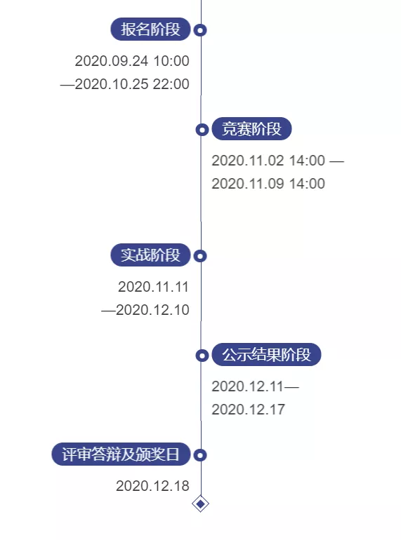

# 大湾区杯数模
[竞赛网站](https://m.wlzq.cn/zt/fmcompetition/pc.html)
[第一届“大湾区杯”粤港澳金融数学建模竞赛](https://mp.weixin.qq.com/s/ml3DH7rJcKE53030NlRfCA)
[第一届“大湾区杯”粤港澳金融数学建模竞赛线上培训讲座](https://www.bilibili.com/video/BV1Ck4y1C7zH)

## 竞赛规则

报名日期为2020年9月24日10:00至2020年10月25日22:00，竞赛不收取报名费。
竞赛时间：2020年11月2日（周一）14:00时至11月9日（周一）14:00时（7天）
参赛者由不超过3名在读大学生、或研究生组队参赛。同一队参赛学生必须来自同一所学校，可以专科、本科、研究生单独组队，也可以混合组队，但组别以参赛队员中最高学历分类，分别分成专科组，本科组，研究组。
赛题来源于金融投资领域的现实需求，赛题分A，B两题，参赛队在规定的时间选一题作答。赛题将于竞赛开赛时在相关网站公布。
参赛者根据竞赛题目要求，以数学建模方法为基础，完成一份金融问题的解决方案，并以论文的形式提交。
选择A题的参赛论文还需于11月11日前将量化策略提交同花顺MindGo量化交易平台或点宽Auto-Trader量化平台进行为期一个月的模拟实战。
参赛论文由组委会聘请专家评阅。除了金奖外，所有的奖项分专科组、本科组、研究生组分组评阅。建模方案的可行性、创造性和可实践性为论文评判的基本准则。

