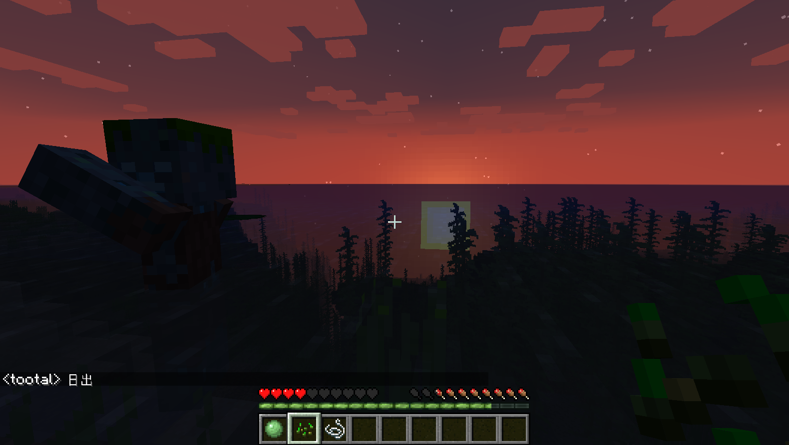

# 20200124开始没有2019-nCov的世界
窗口分辨率 1580*893

* 不可以使用命令作弊
* 仅保存在本地游玩
* 注意经常备份地图
* 更新到最新版本

由于出生点在海边，非常不方便，先收集一些必要的物资。

现在到了一座新岛上。
准备建一座临时定居点，先发展一下。
这岛好小啊，挖一点煤和铁就走吧。

接下来去世界的中心看看！！

。。。。。

先发展一整子再说吧。
进了一个大矿洞，趁现在在炼铁写点东西。相对较安全吧，本来没有做好探kuang'don