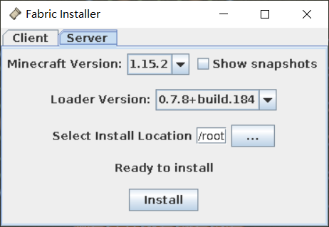
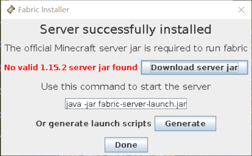

# 20200218搭建MC服务器
以前记录的一些资料：
[20190802服务器.md](20190802服务器.md)
[20190807Minecraft开始.md](20190807Minecraft开始.md)

MCBBS资料：
[从零开始搭建Minecraft Linux服务器.pdf](_v_attachments/20200218204938040_7060/从零开始搭建Minecraft%20Linux服务器.pdf)
[从零开始搭建Minecraft Linux服务器第二章.pdf](_v_attachments/20200218204938040_7060/从零开始搭建Minecraft%20Linux服务器第二章.pdf)
[从零开始搭建MinecraftLinux服务器第三章.pdf](_v_attachments/20200218204938040_7060/从零开始搭建MinecraftLinux服务器第三章.pdf)
[从零开始搭建Minecraft Linux服务器第四章.pdf](_v_attachments/20200218204938040_7060/从零开始搭建Minecraft%20Linux服务器第四章.pdf)
[从零开始搭建Minecraft Linux服务器第五章_1.pdf](_v_attachments/20200218204938040_7060/从零开始搭建Minecraft%20Linux服务器第五章_1.pdf)
[从零开始搭建Minecraft Linux服务器第六章.pdf](_v_attachments/20200218204938040_7060/从零开始搭建Minecraft%20Linux服务器第六章.pdf)


[如何选择minecraft服务端？](https://www.zhihu.com/question/46881255/answer/109917528)
[联机【Bone】MineCraft开服从入门到精通 —— 达达教你开服 ](https://www.mcbbs.net/thread-868008-1-1.html)
[Ubuntu(Linux)开服教程](https://www.mcbbs.net/thread-770886-1-1.html)
[Linux以及MC开服的全面教程](https://www.mcbbs.net/thread-894575-1-1.html)
[ 【原生整合】【Mod整合包】【1.14.4】fabric这可能是目前最全的可用于服务器原版整合 ](https://www.mcbbs.net/forum.php?mod=viewthread&tid=900226)
[Minecraft 的多人游戏是如何发展起来的？](https://www.zhihu.com/question/28323894/answer/59771912)


文件下载：
[Yive's Mirror](https://yivesmirror.com/downloads/paper)
[Paper服务器核心下载](https://papermc.io/downloads)

## 最快的方式
下载 Minecraft ：Java 版的服务器

想建立多人游戏服务器？

请注意：该服务器的安装程序仅与 Minecraft：Java Edition 兼容。

如果您想独自运行 Minecraft 多人服务器，情况就会略显复杂（请查看[此 Wiki 文章上的教程](http://www.minecraftwiki.net/wiki/Setting_up_a_server)）。首先确保您可以在命令行使用 Java。在 Linux 和 Mac OS X 上，此功能应该已经设置好，但在 Windows 上，您可能必须摆弄一下 PATH 环境变量。

下载 [minecraft_server.1.15.2.jar](https://launcher.mojang.com/v1/objects/bb2b6b1aefcd70dfd1892149ac3a215f6c636b07/server.jar) 并用以下命令运行：

`java -Xmx1024M -Xms1024M -jar minecraft_server.1.15.2.jar nogui`

Should you want to start the server with its graphical user interface you can leave out the "nogui" part.

如您所知，在此页面下载任何软件，即表示您同意 [Minecraft 最终用户许可协议](https://jfmsu.minecraft.net/terms)和[隐私政策](https://go.microsoft.com/fwlink/?LinkId=521839)。


`apt install openjdk-8-jdk`，

## 命令
```
/advancement (grant|revoke)
/ban <targets> [<reason>]
/ban-ip <target> [<reason>]
/banlist [ips|players]
/bossbar (add|get|list|remove|set)
/clear [<targets>]
/clone <begin> <end> <destination> [filtered|masked|replace]
/data (get|merge|modify|remove)
/datapack (disable|enable|list)
/debug (report|start|stop)
/defaultgamemode (adventure|creative|spectator|survival)
/deop <targets>
/difficulty [easy|hard|normal|peaceful]
/effect (clear|give)
/enchant <targets> <enchantment> [<level>]
/execute (align|anchored|as|at|facing|if|in|positioned|rotated|run|store|unless)
/experience (add|query|set)
/fill <from> <to> <block> [destroy|hollow|keep|outline|replace]
/forceload (add|query|remove)
/function <name>
/gamemode (adventure|creative|spectator|survival)
/gamerule (announceAdvancements|commandBlockOutput|disableElytraMovementCheck|disableRaids|doDaylightCycle|doEntityDrops|doFireTick|doImmediateRespawn|doInsomnia|doLimitedCrafting|doMobLoot|doMobSpawning|doPatrolSpawning|doTileDrops|doTraderSpawning|doWeatherCycle|drowningDamage|fallDamage|fireDamage|keepInventory|logAdminCommands|maxCommandChainLength|maxEntityCramming|mobGriefing|naturalRegeneration|randomTickSpeed|reducedDebugInfo|sendCommandFeedback|showDeathMessages|spawnRadius|spectatorsGenerateChunks)
/give <targets> <item> [<count>]
/help [<command>]
/kick <targets> [<reason>]
/kill [<targets>]
/list [uuids]
/locate (Buried_Treasure|Desert_Pyramid|EndCity|Fortress|Igloo|Jungle_Pyramid|Mansion|Mineshaft|Monument|Ocean_Ruin|Pillager_Outpost|Shipwreck|Stronghold|Swamp_Hut|Village)
/locatebiome <biome>
/loot (give|insert|replace|spawn)
/me <action>
/msg <targets> <message>
/op <targets>
/pardon <targets>
/pardon-ip <target>
/particle <name> [<pos>]
/playsound <sound> (ambient|block|hostile|master|music|neutral|player|record|voice|weather)
/recipe (give|take)
/reload
/replaceitem (block|entity)
/save-all [flush]
/save-off
/save-on
/say <message>
/schedule (clear|function)
/scoreboard (objectives|players)
/seed
/setblock <pos> <block> [destroy|keep|replace]
/setidletimeout <minutes>
/setworldspawn [<pos>]
/spawnpoint [<targets>]
/spectate [<target>]
/spreadplayers <center> <spreadDistance> <maxRange> <respectTeams> <targets>
/stop
/stopsound <targets> [*|ambient|block|hostile|master|music|neutral|player|record|voice|weather]
/summon <entity> [<pos>]
/tag <targets> (add|list|remove)
/team (add|empty|join|leave|list|modify|remove)
/teammsg <message>
/teleport (<destination>|<location>|<targets>)
/tell -> msg
/tellraw <targets> <message>
/time (add|query|set)
/title <targets> (actionbar|clear|reset|subtitle|times|title)
/tm -> teammsg
/tp -> teleport
/trigger <objective> [add|set]
/w -> msg
/weather (clear|rain|thunder)
/whitelist (add|list|off|on|reload|remove)
/worldborder (add|center|damage|get|set|warning)
/xp -> experience
```

## 配置文件
```
#Minecraft server properties
#Tue Feb 18 22:04:54 CST 2020
spawn-protection=16
max-tick-time=60000
query.port=25565
generator-settings=
force-gamemode=false
allow-nether=true
enforce-whitelist=false
gamemode=survival
broadcast-console-to-ops=true
enable-query=false
player-idle-timeout=0
difficulty=easy
spawn-monsters=true
broadcast-rcon-to-ops=true
op-permission-level=4
pvp=true
snooper-enabled=true
level-type=default
hardcore=false
enable-command-block=false
max-players=20
network-compression-threshold=256
resource-pack-sha1=
max-world-size=29999984
function-permission-level=2
rcon.port=25575
server-port=25565
server-ip=
spawn-npcs=true
allow-flight=false
level-name=world
view-distance=10
resource-pack=
spawn-animals=true
white-list=false
rcon.password=
generate-structures=true
max-build-height=256
online-mode=true
level-seed=
use-native-transport=true
prevent-proxy-connections=false
enable-rcon=false
motd=A Minecraft Server

```

文件备份：
[mc.sh.txt](_v_attachments/20200218204938040_7060/mc.sh.txt)
[server.properties.txt](_v_attachments/20200218204938040_7060/server.properties.txt)

## farbic服务端




