# Minecraft服务器
## 准备
准备安装Fabric服务器，版本为1.16.1
因为Fabric的服务端安装需要界面，因此使用XShell连接服务器，同时安装XManager（显示界面）、XFtp（传输文件）作为辅助。

[XShell6全家桶.md](XShell6全家桶.md)

## 连接服务器
连接服务器后，先看下内存情况：

```
root@tootal:~# free
              total        used        free      shared  buff/cache   available
Mem:        2048124       78408      905624       24544     1064092     1741248
Swap:             0           0           0

```


先搭建好吧，后面再优化。

## 配置
下载fabric服务端文件：[下载地址](https://fabricmc.net/use/?page=server)

```
root@tootal:~/minecraft# wget -O fabric-installer-0.6.1.45.jar https://maven.fabricmc.net/net/fabricmc/fabric-installer/0.6.1.45/fabric-installer-0.6.1.45.jar
--2020-07-19 21:26:18--  https://maven.fabricmc.net/net/fabricmc/fabric-installer/0.6.1.45/fabric-installer-0.6.1.45.jar
Resolving maven.fabricmc.net (maven.fabricmc.net)... 172.67.173.76, 104.27.174.198, 104.27.175.198, ...
Connecting to maven.fabricmc.net (maven.fabricmc.net)|172.67.173.76|:443... connected.
HTTP request sent, awaiting response... 200 OK
Length: 305672 (299K) [application/java-archive]
Saving to: ‘fabric-installer-0.6.1.45.jar’

fabric-installer-0.6.1.45. 100%[=====================================>] 298.51K   739KB/s    in 0.4s    

2020-07-19 21:26:20 (739 KB/s) - ‘fabric-installer-0.6.1.45.jar’ saved [305672/305672]

root@tootal:~/minecraft# ls
fabric-installer-0.6.1.45.jar

```

运行安装器：

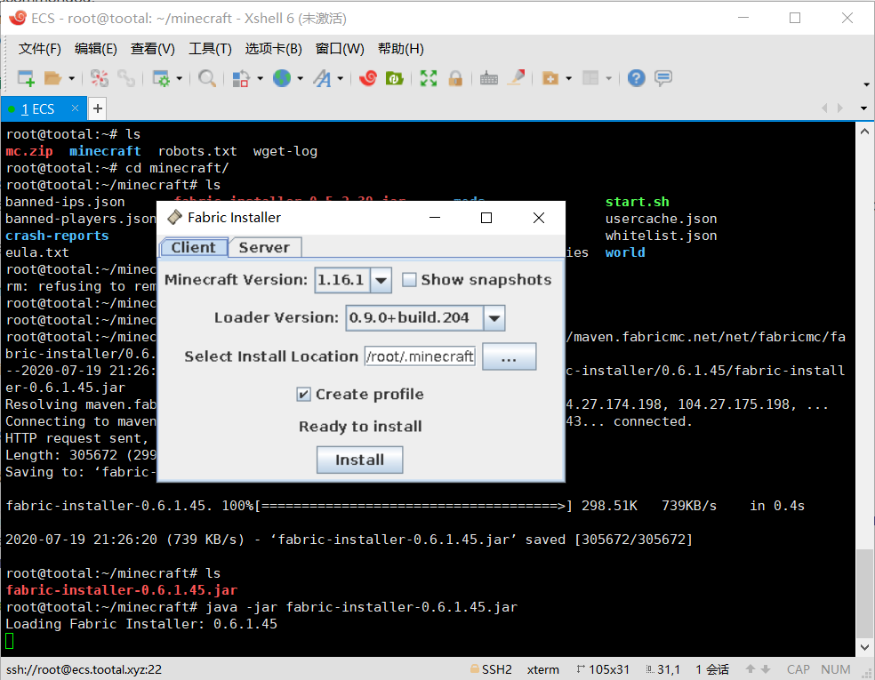

安装成功：

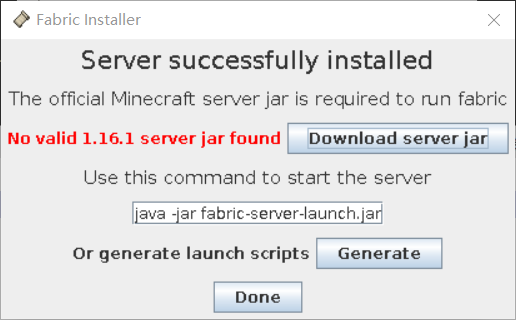

下载服务端核心（点击Download server jar）

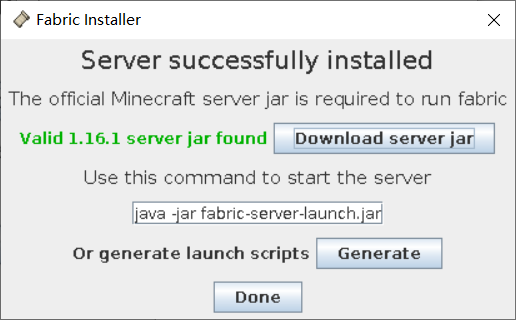

java -jar fabric-server-launch.jar

```
root@tootal:~/minecraft# java -jar fabric-installer-0.6.1.45.jar 
Loading Fabric Installer: 0.6.1.45
duplicate file: module-info.class
duplicate file: module-info.class
duplicate file: module-info.class
duplicate file: module-info.class
duplicate file: META-INF/MANIFEST.MF
root@tootal:~/minecraft# ls
fabric-installer-0.6.1.45.jar  fabric-server-launch.jar  server.jar  start.bat  start.sh
```

输入`./start.sh`运行。

提示需要同意协议，将eula.txt中的false改为true即可。

再次运行。

会启动一个界面。

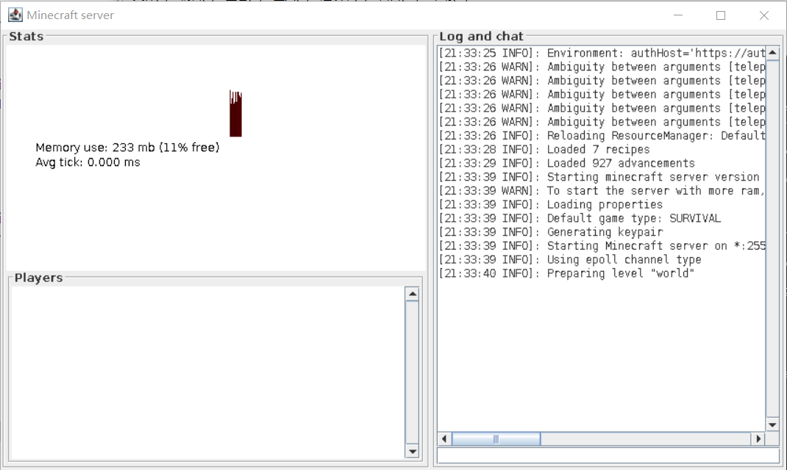

## 连接
在本地安装一个1.16.1版本的游戏，先不安装fabric，启动连接服务器。

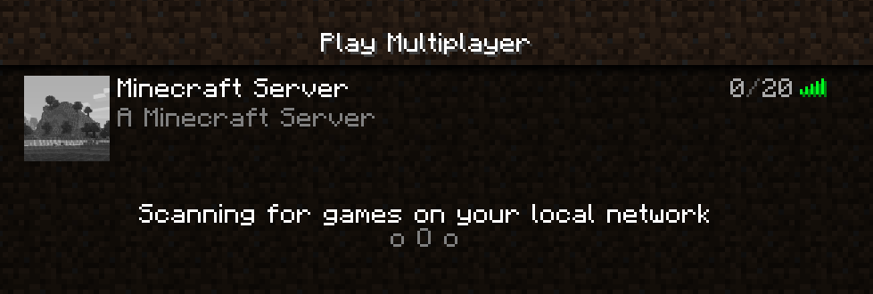
说明可以检测到。

连接时如果出现：

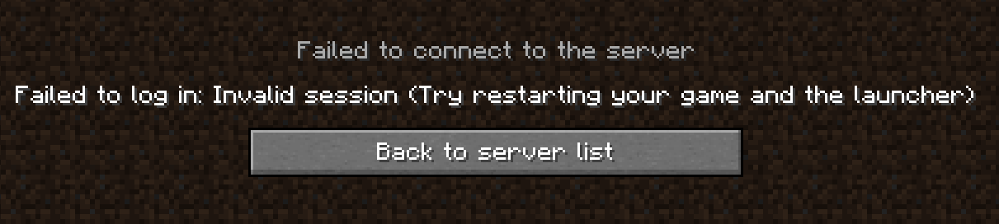

需要在服务器端关闭正版验证。

在XShell中输入stop关闭服务器。

编辑sever.properties文件。
将`online-mode`改为false。

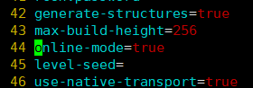

重新启动服务器，通常来说服务器不需要界面。编辑start.sh，在命令后面加上nogui参数。

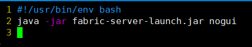

这次不会有界面了。
接下来就可以成功进入服务器了。
服务端可以看到消息：

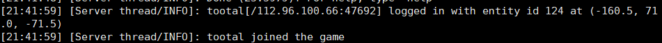


调整一下配置，重新生成一下世界。

调整难度为hard
最多玩家数设置为10（考虑到后期可能会有一些工具人）
种子设置为：20200719（开服日期）
提示语motd设置为：Tootal Minecraft Server
视距：6

删掉之前的world文件夹，重新启动。


## 服务器游玩
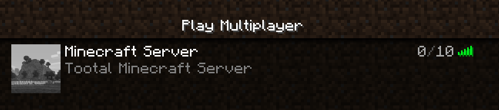
连接服务器后，先测试一下权限。

默认是没有权限的，直接在服务端授予自己op权限。

`op tootal`

现在OK了。

可以发现，本地不安装fabric也可以连接fabric的服务器的。


## replay mod
先装一些本地mod。
装上fabric。

准备第一个装replaymod，这个mod可以记录游玩的过程。
还有挺多好处的，比如可以后期导出视频，防止滥用op权限。

[https://www.replaymod.com/](https://www.replaymod.com/)

先进入游戏玩个5分钟，看看记录的效果吧。

进入游戏发现是黑夜，有点尴尬。。。

只能挖三填一，十分窘迫的度过服务区生存第一晚，更尴尬的是还被记录下来了。

第一晚摸黑生存实在艰难，还是困难模式。

OK，终于天亮了，开局还不错，床的材料和定居点已经找好了。

## 添加地图mod
这个还是挺重要的，极大增强游戏体验。

先单独装在本地，看下有没有用。

记得要fabric-api

显示不出数据，看样子还是要服务端支持。

## 后台运行
服务器肯定要支持后台运行的，否则关了XShell后服务器就关闭了。
我用较为熟悉的tmux来运行。

```
root@tootal:~/minecraft# tldr tmux

  tmux

  Multiplex several virtual consoles.
  More information: https://github.com/tmux/tmux.

  - Start a new tmux session:
    tmux

  - Start a new named tmux session:
    tmux new -s name

  - List sessions:
    tmux ls

  - Attach to a session:
    tmux a

  - Attach to a named session:
    tmux a -t name

  - Detach from session:
    Ctrl + B, D

  - Kill session:
    tmux kill-session -t name

  - Kill session when attached:
    Ctrl + B, x (then hit 'y' for yes)


```

tmux new -s mc
./start.sh
Ctrl+B, D
此时可以退出XShell了。

## 添加常用mod
为了避免问题，本地和服务端都装上。

目前本地安装的mod有，基本是原版的辅助mod。

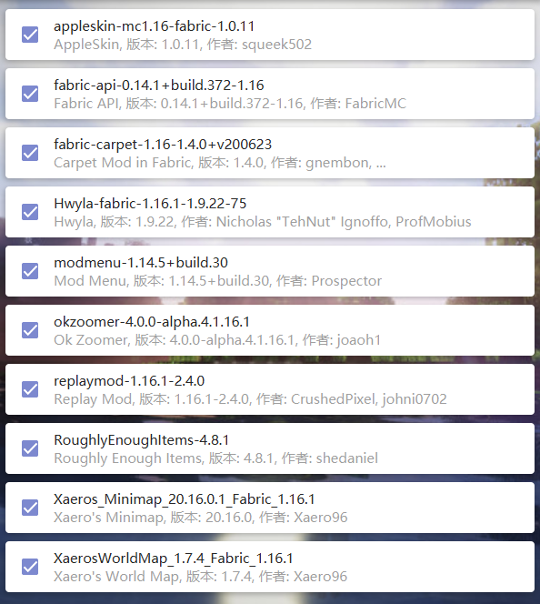

服务器的mod差不多，除了replaymod

其实本地使用原版客户端也可以登录，就是没了那些扩展功能。

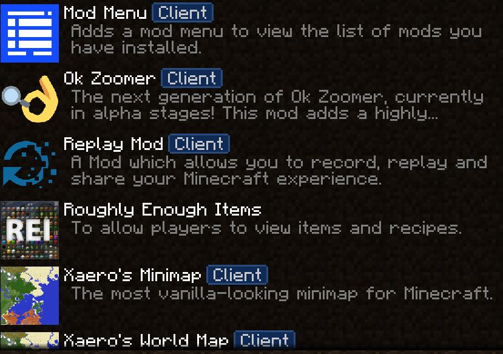


OK，养老服差不多开好了！！！

搞了个工具人在家里。

删掉服务器里上面显示Client的模组。

还是装上一个死亡箱比较好，毕竟是养老服，也不太影响平衡。

把本地的carpet删了，貌似是服务端模组。

OK，差不多搞清楚了，那些mod是服务端的，哪些是客户端的。

判断mod是否要在服务端安装首先要知道它会不会更改游戏中的物品或添加物品，更改地形。如果是的话，那么这个mod要在服务端安装，同时在客户端安装才会生效。如果类似小地图、合成表、自动钓鱼这种辅助类型不更改游戏数据的这种mod就可以不用在服务端安装。

发现一个尴尬的问题，没什么流量了。
只能先玩本地的坑了。

