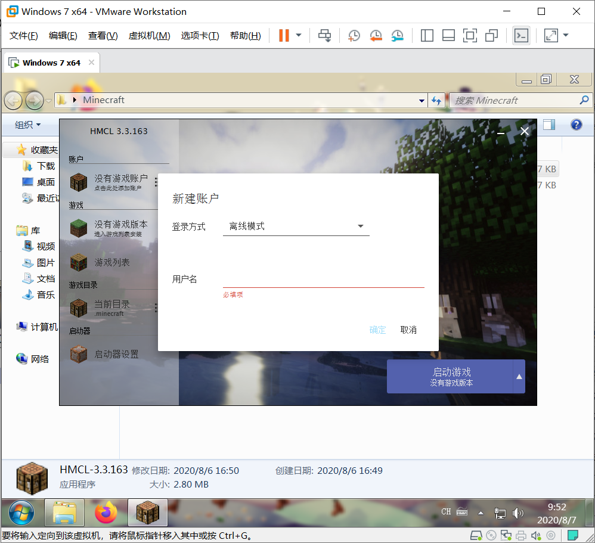

# Minecraft离线安装包制作
目标版本：1.16.1
要求：自带Fabric的一些常用模组。

HMCL和Java目前已经下载完毕了。

正在下载Windows10系统镜像。准备在虚拟机中测试。

忽然想到可以在Windows7下测试。

## Windows7虚拟机

正在安装系统。

这次安装好了搞个快照，也方便以后测试。

OK，虚拟机安装好了。

主要就是设置了桌面图标和背景、安装一个浏览器，然后更新一下系统，就可以创建一个快照了。（作为白板Win7系统）

浏览器是由于自带的是IE9实在没法用，就装了一个Firefox。

一大堆更新。。

不过也正常，毕竟是刚刚安装的系统。

安装更新又好慢啊。。。

安装了好几个小时了都。

终于OK了 。

## 创建快照
忽然发现Windows自带的沙盒还是挺方便的，不过感觉还是这个快照功能更强大一些。

## 测试Minecraft

直接运行了一下，提示没有java环境，正常。

安装jre。

个人习惯，关闭了Java更新。

此时可以正常启动了。

安装最新稳定版1.16.1

同时安装Fabric。

游戏资源会下载到当前目录，同时会在系统缓存。
（例如删掉游戏版本后，再次下载会非常快，因为直接从缓存复制过来的。）

要下载安装一段时间。

修改了一下设置。

尝试启动一下。

成功了。

创建了一个地图玩了一下，感觉有点卡，其他还行。

直接打包了。

## 便携性测试
整个文件夹（含JRE、HMCL、Minecraft）zip压缩后大概421M。保存到主机上。

虚拟机关机，回退到之前的快照。

再次开机。

复制、解压。

顺便断开虚拟机的网络。

OK，测试成功，不用网络即可访问。

接下来就是删除一些信息了。

虚拟机关掉，直接在本地的压缩包里更改。

## 整理压缩包
OK，直接在本地整理了。

[材质包](https://polyflore.net/projects/depixel)

完成啦！！！

* 包含Java 8 （JRE）
* 包含HMCL启动器、包含背景图
* 包含已安装版本1.16.1（Fabric）、1.12.2（Forge+Optifine）离线可玩
* 附带少量模组、地图、光影、材质包、数据包

总大小约：569M
