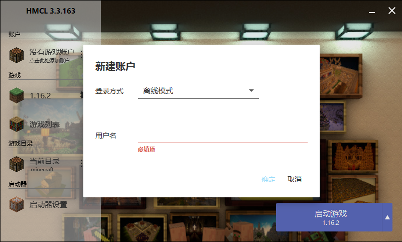
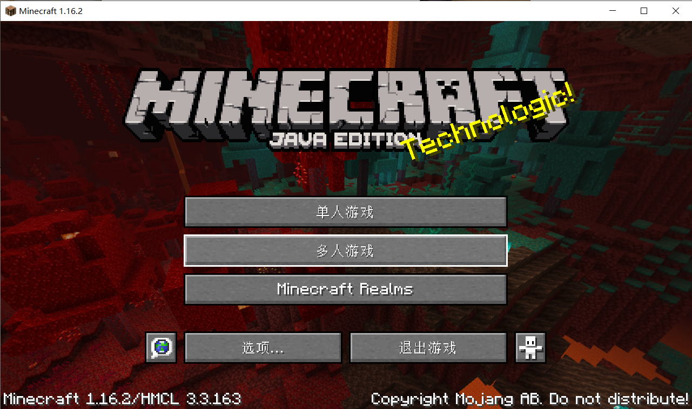

# 我的世界（Minecraft）Java版安装指南
压缩包包含以下文件，均可离线安装使用。

* Java运行时环境
* HMCL启动器
* 最新正式版1.16.2
* 壁纸图片

安装步骤：

1. 解压压缩包
2. 双击HMCL文件运行

若出现提示没有Java运行环境，则先运行Java安装包。

启动器运行成功截图：

输入用户名，点击右下角按钮即可启动游戏。

游戏启动成功截图：

