# 老家台式机改造
先看看主板的型号吧，查看一下主板的资料，看看要不要换。

[如何确认主板型号](https://zh.wikihow.com/确认主板型号)

找到主板型号。型号会印刷在主板上，但是具体位置会有所不同。型号位置可能会靠近内存插槽，也可能会靠近CPU插槽，或者在PCI插槽之间。主板型号有可能不包括制造商信息，但是大部分新型主板会同时列出制造商和型号编码。
主板上印刷有大量文字信息内容，但是主板型号一般采用最大字体印刷。
安装其他部件后，主板型号可能会看不清。如果你发现有其他部件挡住了型号信息，可以小心将该部件下拆卸，然后在查看型号后将其重新安装好。如果计算机很久没有清洁，灰尘可能会遮住型号信息，那么你需要清洁主板才能查看。
主板型号一般由5-7个数字和字母组成。

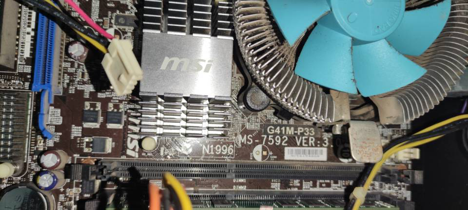


OK，找到了主板的型号。

[G41M-P33](https://www.msi.com/Motherboard/support/G41M-P33)

应该是微星的主板，可以下载到CPU的手册。

淘宝查了一下，现在这个卖80块钱。

[微星G41M-P33 P43 Combo主板DDR2和DDR3内存都有 MS-7592 VER:7.1](https://item.taobao.com/item.htm?spm=a230r.1.14.1.2a396750QIGEgN&id=628386807127&ns=1&abbucket=7#detail)

60块钱的也有。

现在开不了机，原因是硬盘连接不稳定。

看下这个主板能不能接固态硬盘，可以的话尝试接笔记本的硬盘上去。

正好笔记本有两个硬盘。

目前台式机上面只有一个500G的机械硬盘，SATA接口。


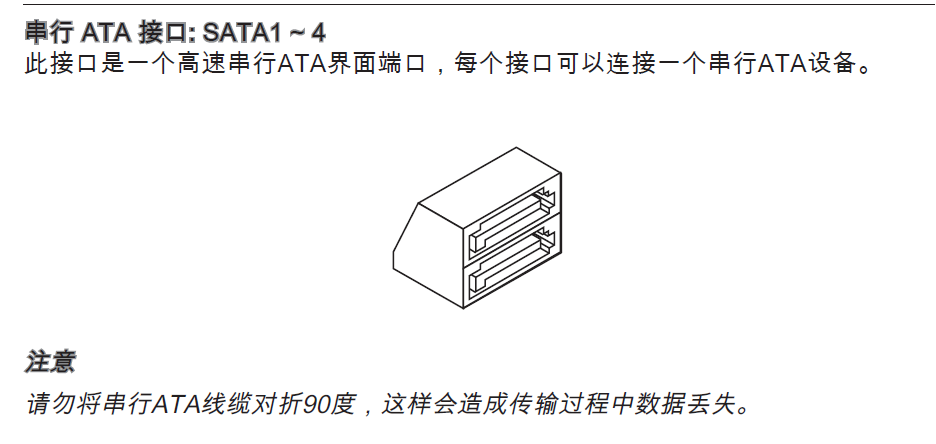


目前硬盘里还有一些数据，我目前也不清楚是硬盘的问题还是主板的问题。

先看看能不能把笔记本的固态硬盘接到台式机上面吧。

[笔记本硬盘能当台式机硬盘吗?接口有不同吗](http://ask.zol.com.cn/x/2640330.html#:~:text=笔记本硬盘可以作为台式,直接在台式机上使用。)

> 笔记本硬盘可以作为台式机的硬盘使用，接口都是一样的。
> 笔记本硬盘和台式机的硬盘主要的区别有：
> 一是尺寸上的不同，笔记本硬盘是2.5英寸，台式机硬盘是3.5英寸的，虽然尺寸不同，但笔记本硬盘可以通过专用的硬盘支架固定到台式机的机箱里，由于数据接口和供电接口都是一样的，所以可以直接在台式机上使用。
> 二是笔记本硬盘和台式机硬盘的转速不同，2.5英寸的硬盘就一般用在笔记本上，体积小就注定这种硬盘的速度不能很快，一般是5400rpm(round per minute)转/每分钟。有些也可以达到7200转/分钟的。而3.5英寸的硬盘一般都是7200转/分钟以上，最高能达到上万转/分钟。所以笔记本硬盘安装到台式电脑上从一定的程度上说会影响到台式电脑的存储数据的传输速度，但影响不大，还是可以在台式机上使用。

笔记本的机械硬盘应该是可以装到台式机上的，就是大小不一样所以可能无法固定。

目前笔记本固态是M2接口的，主板应该不支持，只能先考虑装机械硬盘了。

先把笔记本的机械硬盘拆下来吧。

为了避免数据损失，还是分成两个区比较好。

现在一整个机械硬盘1T作为一个分区。

[易宝典：怎么在不破坏数据的情况下重新划分分区？](https://support.microsoft.com/zh-cn/topic/易宝典-怎么在不破坏数据的情况下重新划分分区-c3d64de0-4672-b21f-de4e-b4908fb35ae3)

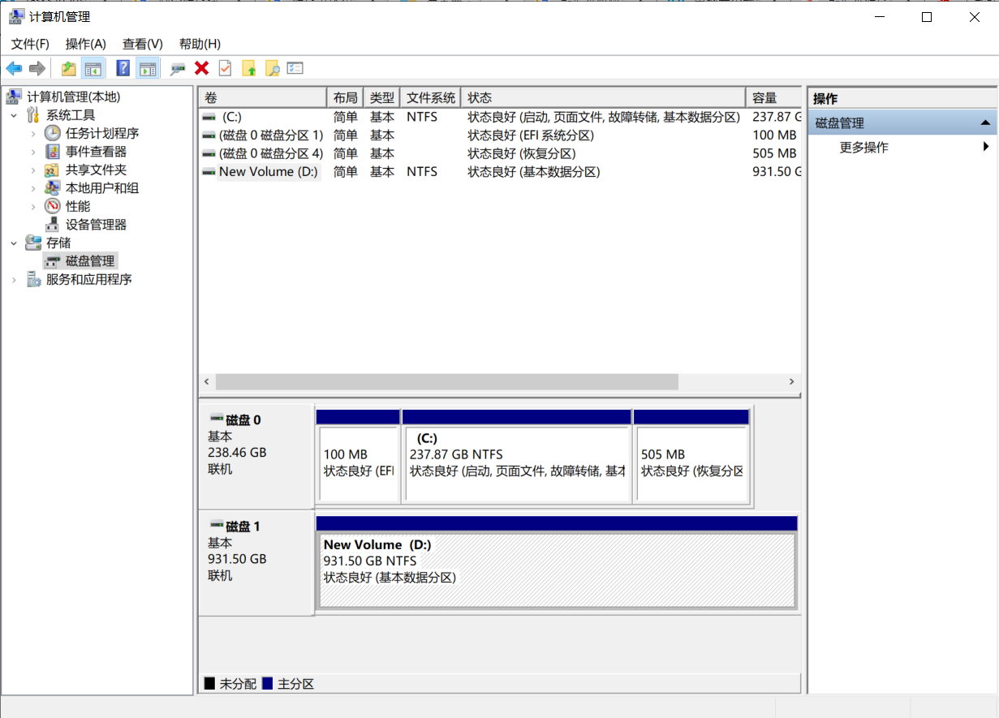

分个200G出来应该够了吧。

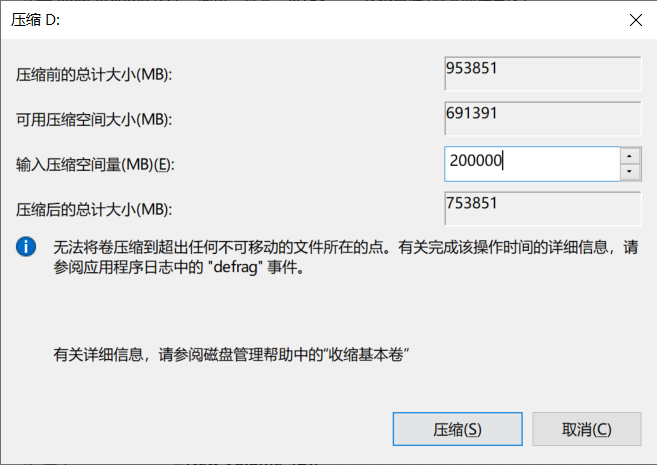

很快啊。

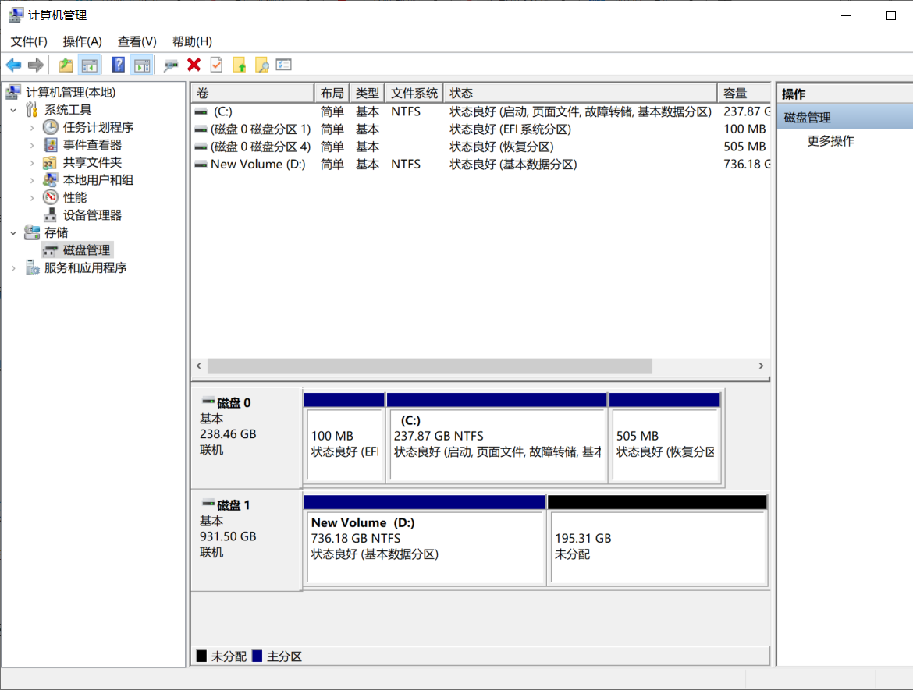

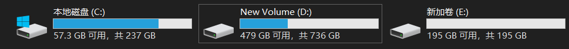

好，现在拆下这个机械硬盘来。


## 机械硬盘安装系统


刚刚尝试了一下，接口确实是一样的。挺好。


下面在机械硬盘上安装XP系统吧。

尴尬了，原来我的iso文件下载错误了。一直以为是什么问题。。。。

我下的原来是xp系统SP3的升级包。。。


浪费了400M流量啊啊啊啊啊啊 ，现在还要500M。。。


这次现在虚拟机安装试试，然后再去台式机安装。

就不再笔记本上测试了。

等不及了，尝试用手机迅雷下载。500M的东西。


果然快，迅雷还是有点东西的。

手机上下载好，再用USB一传，这应该是目前这个情况最快的方法了。

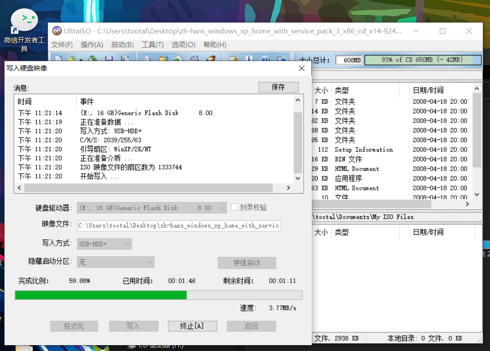

进度很快了，正在写入U盘。

又出现新的问题了，看看能不能解决。

[视频](https://www.youtube.com/watch?v=BjPnAR12eIc&ab_channel=Huwaydi)

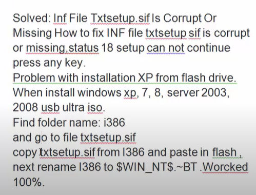

```
$WIN_NT$.~BT

```


还是有问题，太惨了。

先在笔记本装好系统吧。

## 虚拟机安装

不得已只能这样子了，先把iso文件装在虚拟机里。

然后备份，再恢复到机械硬盘上。

```

Microsoft DiskPart 版本 10.0.19041.610

Copyright (C) Microsoft Corporation.
在计算机上: DESKTOP-TOOTAL

DISKPART> list volume

  卷 ###      LTR  标签         FS     类型        大小     状态       信息
  ----------  ---  -----------  -----  ----------  -------  ---------  --------
  卷     0     C                NTFS   磁盘分区         237 GB  正常         启动
  卷     1                      FAT32  磁盘分区         100 MB  正常         系统
  卷     2                      NTFS   磁盘分区         505 MB  正常         已隐藏
  卷     3     D   New Volume   NTFS   磁盘分区         736 GB  正常
  卷     4     E   新加卷          NTFS   磁盘分区         195 GB  正常
  卷     5     F   TOOTAL       NTFS   可移动           13 GB  正常

DISKPART> select volume 05

卷 5 是所选卷。

DISKPART> offline volume

虚拟磁盘服务错误:
仍有到该卷的访问路径。


```

忽然又可以了。


希望这次能行。


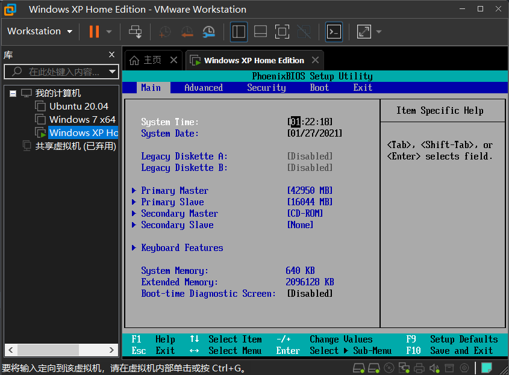

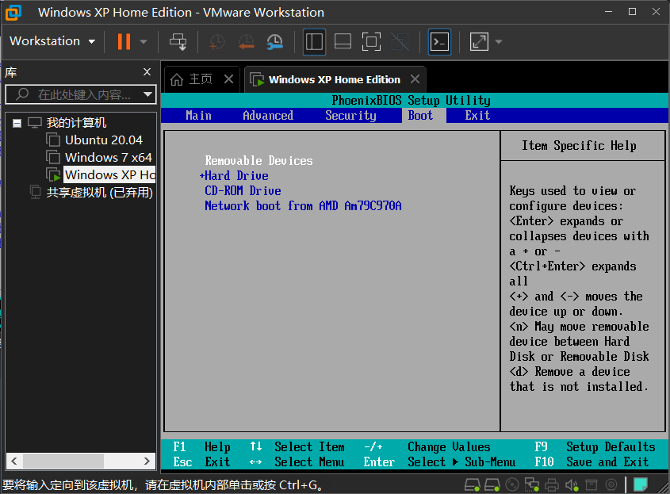

刚刚选错了，要展开，是硬盘。


多尝试几次应该就可以。

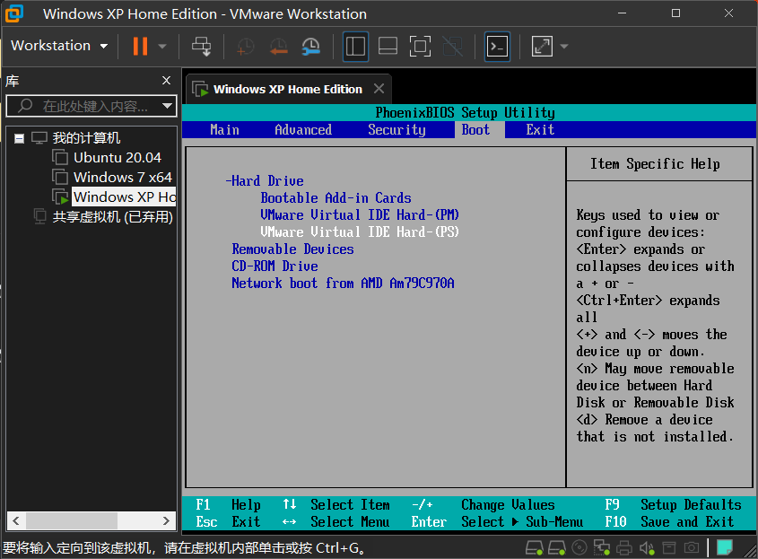

感觉可以，这次黑屏了。

太激动了，等了好久，成了！！！

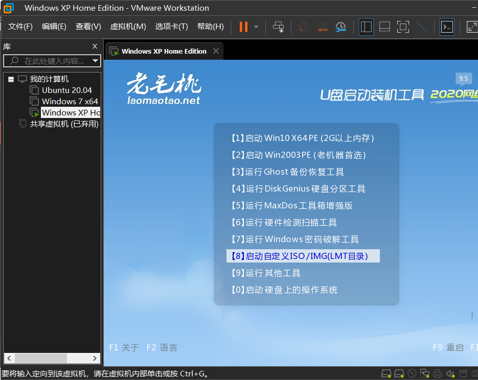

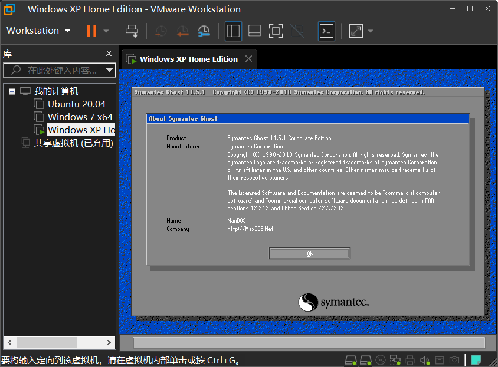

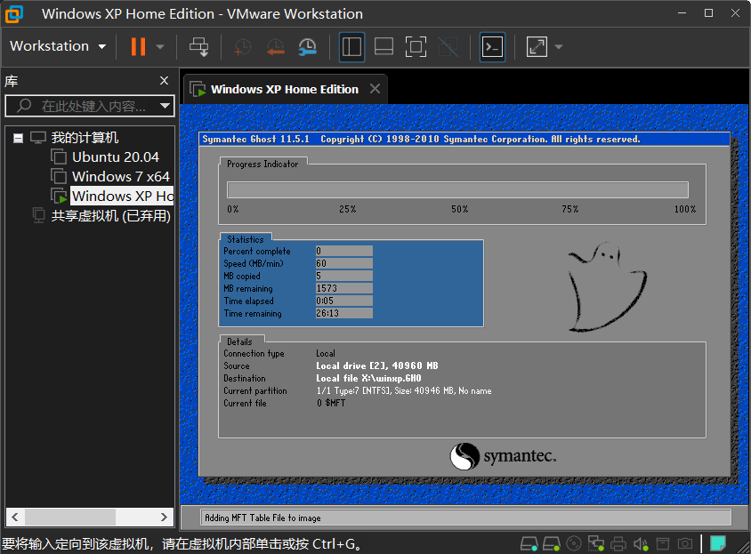

